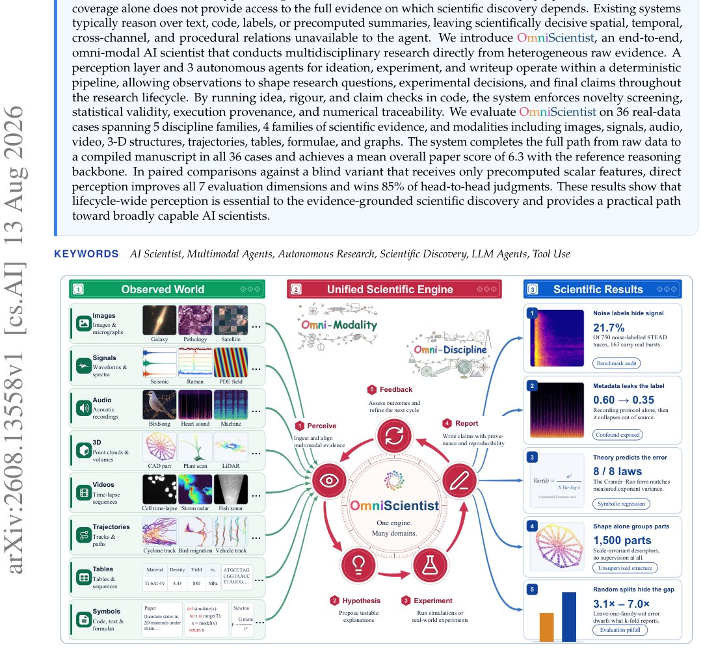

> *Generated by JarvisForResearchers Bot on 2026-08-16*

!!! tip "Why we featured this paper"
    Brand new preprint (2026) — accepted

## TL;DR
OmniScientist is an end-to-end, omni-modal AI scientist that conducts multidisciplinary research directly from heterogeneous raw evidence by integrating a perception layer with three autonomous agents within a deterministic, code-enforced pipeline.

## The Problem
Existing AI systems designed for scientific discovery often achieve workflow completeness at the expense of evidence completeness. This limitation arises because they typically operate over abstracted representations—text, code, labels, or precomputed summaries—thereby discarding scientifically critical information embedded in the raw heterogeneous evidence. Specifically, these systems fail to adequately capture the spatial, temporal, cross-channel, and procedural relationships inherent in the original data.

The gaps in current approaches are threefold:
1. Current agents are constrained to reasoning over artifacts that have already been transformed into discrete modalities (text, code, or numbers), neglecting the raw evidence itself.
2. Agents that incorporate perception usually do so only at localized points, such as inspecting generated figures, failing to establish a continuous research loop where raw observations actively redirect the investigative process.
3. The reliance on pre-processed data (text, code, labels, or summaries) inherently constrains the types of anomalies an agent can detect and the hypotheses it is capable of formulating.

## Key Contributions
We present OmniScientist, an end-to-end, omni-modal, and discipline-agnostic AI scientist capable of operating directly from heterogeneous scientific evidence while preserving critical spatial, temporal, statistical, and procedural relations. We propose a perception-first, multi-agent architecture where raw observations serve as active drivers for ideation, experimentation, and manuscript generation. Furthermore, we integrate code-enforced checks throughout the pipeline to rigorously screen for novelty, ensure statistical validity and execution provenance, prevent Hypothesis After the Results Knowledge (HARKing), and guarantee claim traceability.

## How It Works


*Figure 1. Overview of the OmniScientist framework. Raw multimodal observations spanning multiple disciplines (left) are
fed into a unified engine that perceives evidence, executes falsifiable experiments, and grounds every claim (center). This
continuous pipeline ultimately yields verifiable scienti*

OmniScientist functions as a deterministic pipeline coordinating a specialized perception layer with three core autonomous agents: the Ideation Agent, the Experiment Agent, and the Writeup Agent. Within each agent's operational phase, a ReAct loop is employed, interleaving observation, reasoning, and action. This structure permits raw evidence to dynamically shape the research trajectory. The entire process is governed by a thin, deterministic pipeline that manages stage transitions and enforces critical checks via code. These checks verify novelty evidence, falsifiability, execution provenance, and numerical traceability. Scientific evidence is categorized into four discipline-independent families: perceptual, symbolic, quantitative-statistical, and procedural. The system was evaluated across a 36-case demonstration suite spanning five discipline families and all four evidence families.

### Perception Layer
This component is responsible for ingesting and aligning multimodal evidence. Its function is to enable the entire system to operate directly from the raw artifacts, thereby preserving the fine-grained relational information lost during abstraction.

### Ideation Agent
Guided by the input from the Perception Layer, this agent is tasked with proposing testable explanations. Its reasoning is directly informed by the raw evidence, allowing for the formulation of hypotheses grounded in the observed data structure rather than merely textual summaries.

### Experiment Agent
This agent executes the proposed tests, whether through running simulations or interacting with real-world experimental setups. Its actions are also guided by the raw evidence, ensuring that the experimental design remains tethered to the initial observations.

### Writeup Agent
The final agent is responsible for generating scientific claims. Crucially, its output is grounded in the evidence and includes explicit provenance tracking, ensuring reproducibility and traceability for every assertion made.

### Deterministic Pipeline
This component acts as the central control flow mechanism. It manages the transitions between the Ideation, Experiment, and Writeup stages. It enforces a strict control structure: if an agent's output fails a code-enforced check (e.g., a null result or a failed novelty check), the pipeline dictates a return to the Ideation Agent. It only admits stage outputs after these checks have passed.

## Results
| Metric | Value | Baseline | Source |
| :--- | :--- | :--- | :--- |
| Mean overall paper score | 6.3 | reference reasoning backbone | Abstract |
| Head-to-head judgments (vs. blind variant) | 85% | blind variant that receives only precomputed scalar features | Abstract |

## Why This Matters
The practitioner takeaways highlight several critical insights. First, lifecycle-wide perception is demonstrated to be essential for evidence-grounded scientific discovery, contrasting sharply with methods that rely solely on precomputed feature vectors. Second, the integration of code-enforced checks—specifically for novelty, statistical validity, and execution provenance—provides a necessary, robust control structure for autonomous research systems. Finally, the system's demonstrated discipline-agnostic nature confirms that the core engine can effectively operate across diverse evidence families, including perceptual, symbolic, quantitative-statistical, and procedural data.

## Limitations & Open Questions
Two primary limitations were noted. First, the current paper does not provide a detailed exposition of the specific implementation mechanics of the ReAct loop utilized within each individual agent. Second, the complexity inherent in the 36-case demonstration suite suggests that full, end-to-end execution of the system incurs significant computational demands.

---

## Citation

**Paper:** [2608.13558](https://arxiv.org/abs/2608.13558)

```bibtex
@article{260813558,
  title   = {OmniScientist: An Omni-Modal Omni-Discipline AI Scientist},
  author  = {Bobo Li and Hao Fei and Tianjie Ju and Mong-Li Lee and Wynne Hsu},
  journal = {arXiv preprint arXiv:2608.13558},
  year    = {2026},
  url     = {https://arxiv.org/abs/2608.13558}
}
```
