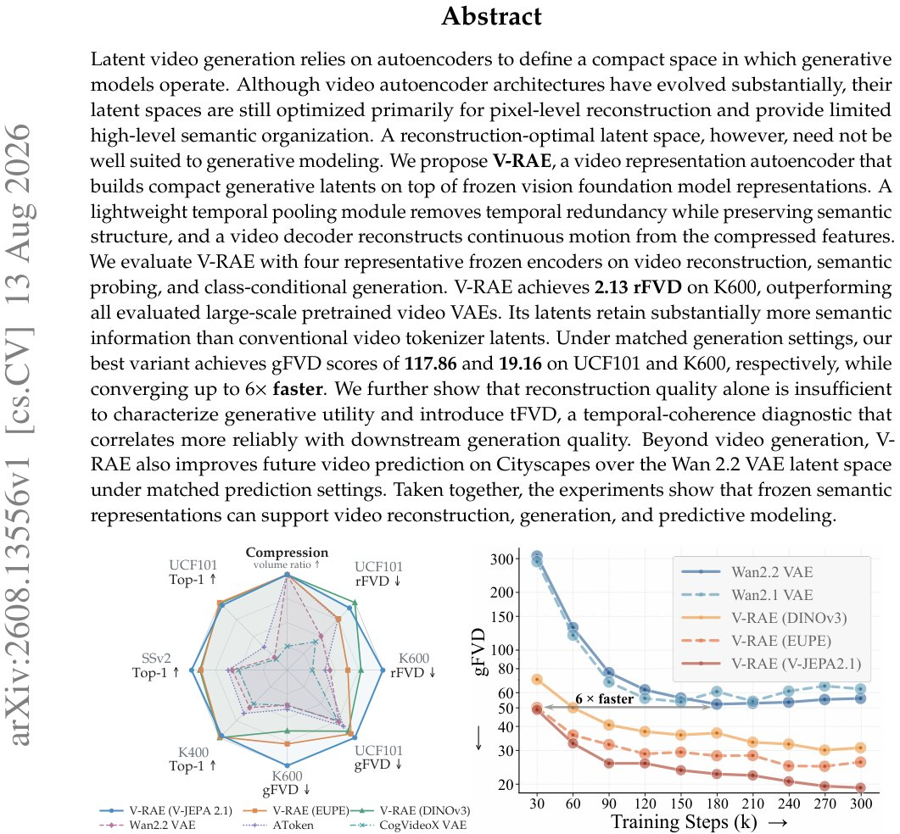

> *Generated by JarvisForResearchers Bot on 2026-08-17*

!!! tip "Why we featured this paper"
    Brand new preprint (2026) — accepted

## TL;DR
V-RAE introduces a video representation autoencoder that constructs generative latents by anchoring to frozen vision foundation model representations. It employs a Lightweight Temporal Pooling Module to compress dense features into a compact sequence, which is then decoded by a Spatiotemporal Transformer Decoder augmented with 3D RoPE. This design, coupled with the introduction of the generation-oriented diagnostic tFVD, demonstrates competitive reconstruction while achieving superior generation quality and faster convergence compared to existing large-scale video VAEs.

## The Problem
Existing video autoencoder latent spaces are fundamentally optimized for pixel-level reconstruction. This optimization objective is insufficient when the ultimate goal is high-fidelity generative modeling, particularly in the domain of video. Video data necessitates the joint modeling of appearance, complex motion dynamics, and long-range temporal dependencies. Prior work often focuses on local textures and fine-grained appearance details, which fails to capture the necessary semantic structure for robust generation. Furthermore, previous attempts to incorporate semantic information typically treat it as auxiliary supervision rather than embedding it directly into the structure of the generative latent space. Extending the paradigm of using frozen image representation encoders to the video domain presents non-trivial challenges related to managing temporal density, ensuring temporal coherence during compression, and maintaining semantic integrity across time.

## Key Contributions
We propose V-RAE, a framework that establishes a generative latent space built upon frozen vision representation encoders. This is achieved through the integration of a temporal pooling mechanism and a specialized spatiotemporal Transformer decoder to effectively manage temporal compression, coherence, and semantic preservation. We introduce tFVD, a novel diagnostic specifically designed to evaluate the generative utility of video autoencoders, thereby highlighting the limitations of relying solely on reconstruction fidelity metrics. Finally, we present a systematic comparative study across four different encoder backbones, demonstrating that V-RAE achieves reconstruction performance competitive with large-scale video VAEs, exhibits superior generation quality, and converges up to $6\times$ faster under matched training conditions.

## How It Works


*Figure 1: V-RAE overview. Left: Normalized reconstruction, generation, compression, and semantic performance
across video tokenizers; FVD axes (↓) are reversed so outward is better. Right: K600 gFVD convergence; V-RAE
converges up to 6× faster than VAE-based latent spaces.*

V-RAE operates by coupling a pre-trained, frozen visual representation encoder with a learnable temporal pooling module and a Transformer-based video decoder. The encoder generates temporally dense feature maps from the input video. The Lightweight Temporal Pooling Module then compresses these dense features into a compact video latent sequence, $\mathcal{Z}$. This compression is achieved by segmenting the features into non-overlapping temporal windows of length $r_P$ and applying temporal attention pooling to map each window to a single latent feature map. The Spatiotemporal Transformer Decoder, which incorporates 3D RoPE, reconstructs the video $\hat{X}$ from the compressed latent sequence $\mathcal{Z}$. The training objective, $L_{recon}$, is a composite loss function incorporating $L1$, $LPIPS$, $L_{GAN}$, and $L_{Gram}$. For the generation phase, a Diffusion Transformer (DiT) is trained within the latent space using rectified flow, utilizing a dimension-dependent shift $\hat{\tau}$ to appropriately handle the temporal latent length $T_Z$.

### Frozen Visual Representation Encoder
This component consists of pretrained encoders, such as DINOv3, SigLIP2, EUPE, or V-JEPA 2.1. These models provide rich spatial and semantic feature representations. Crucially, these encoders remain fixed throughout the V-RAE training process, leveraging their pre-learned knowledge to guide the latent space construction without requiring extensive retraining of the backbone.

### Lightweight Temporal Pooling Module (P)
This module is designed to manage the temporal redundancy inherent in dense video features. It operates by dividing the feature sequence output by the frozen encoder into non-overlapping temporal windows, each of length $r_P$. For each window, temporal attention pooling is applied to aggregate the features into a single, representative latent feature map. This process effectively compresses the temporal dimension while retaining salient information.

### Spatiotemporal Transformer Decoder
This is the generative component responsible for reconstructing the video $\hat{X}$ from the compact latent representation $\mathcal{Z}$. It is structured as a lightweight Transformer decoder, adapted from the MAE architecture. To ensure temporal consistency during reconstruction, this decoder is augmented with 3D Rotary Position Embeddings (RoPE).

### Multi-frame Unpatchify Layer
This layer is necessary to bridge the gap between the compressed latent space and the high-dimensional pixel space. It has been modified specifically to account for the overall temporal compression ratio, $r_{all}$, ensuring that each latent time step is correctly mapped back to $r_{all}$ consecutive frames during the decoding process.

## Results
| Metric | Value | Baseline | Source |
| :--- | :--- | :--- | :--- |
| rFVD on K600 | 2.13 | all evaluated large-scale pretrained video VAEs | Abstract |
| gFVD on UCF101 | 117.86 | all evaluated VAE-based latent spaces | Abstract |
| gFVD on K600 | 19.16 | all evaluated VAE-based latent spaces | Abstract |
| Convergence Speed | up to $6\times$ faster | matched training settings | Abstract |
| Top-1 accuracy on UCF101 (DINOv3-L) | 89.13% | 30.83% (strongest VAE baseline) | Abstract |

## Why This Matters
The V-RAE framework addresses a critical gap in video representation learning: the misalignment between reconstruction fidelity and generative utility. By explicitly designing the latent space around the semantic priors of frozen vision models and introducing generation-centric diagnostics like tFVD, we provide a more rigorous evaluation standard for video autoencoders. The empirical results demonstrate that this architectural approach allows for significant efficiency gains—up to $6\times$ faster convergence—while maintaining high quality, suggesting that leveraging pre-trained semantic knowledge is a powerful pathway to building effective, compact generative models for complex temporal data.

## Limitations & Open Questions
A primary limitation highlighted by the results is the divergence between the rankings produced by rFVD and gFVD across different video autoencoders. This suggests a fundamental disconnect between optimizing for pixel-level reconstruction accuracy and achieving genuine generative capability. Furthermore, the entire methodology rests on the assumption that the semantic information encoded within the frozen representations is sufficiently robust to support the subsequent tasks of reconstruction, generation, and predictive modeling across diverse video domains. Future work must investigate the robustness of this assumption when dealing with highly novel or out-of-distribution video content.

---

## Citation

**Paper:** [2608.13556](https://arxiv.org/abs/2608.13556)

```bibtex
@article{260813556,
  title   = {V-RAE: Rethinking Video Latent Spaces for Generation},
  author  = {Minghui Guo and Shengqiong Wu and Hao Fei},
  journal = {arXiv preprint arXiv:2608.13556},
  year    = {2026},
  url     = {https://arxiv.org/abs/2608.13556}
}
```
