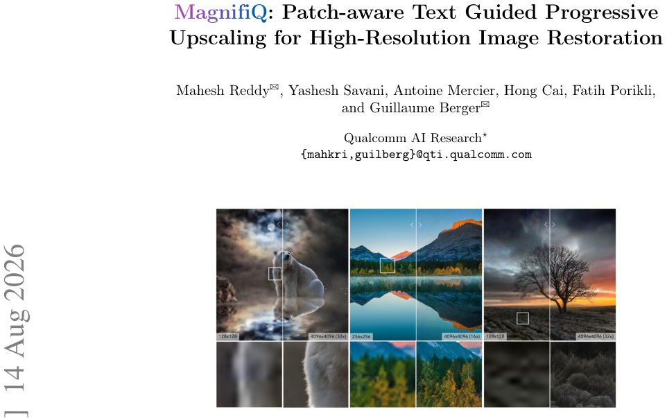

> *Generated by JarvisForResearchers Bot on 2026-08-18*

!!! tip "Why we featured this paper"
    Brand new preprint (2026) — accepted

## TL;DR
MagnifiQ introduces a patch-aware, text-guided progressive upscaling framework capable of restoring low-quality images up to $4096 \times 4096$. It achieves this by adapting SDXL, substituting self-attention with efficient PADRe layers, and employing Patch-Aware Cross-Attention (PACA) to inject spatially localized semantic guidance derived from patch-specific text prompts.

## The Problem
High-resolution image restoration presents a dual challenge: maintaining global structural integrity while simultaneously recovering intricate, fine-grained local details. When targeting resolutions such as 4K, direct application of standard diffusion-based restoration methods becomes prohibitively expensive computationally. Furthermore, these direct methods often suffer from the generation of repetitive or inconsistent textures across large image domains.

Existing methodologies exhibit specific limitations. Many are restricted to moderate upscaling factors, typically capped around $4\times$. Approaches like StableSR incur high computational overhead because they mandate independent denoising of every image patch at every diffusion timestep. Conversely, methods such as FaithDiff rely exclusively on global prompting, which fails to provide the necessary region-specific guidance required for accurate fine-grained detail recovery.

## Key Contributions
We introduce MagnifiQ, a framework designed for progressive upscaling and restoration, enabling upscaling factors up to $32\times$. A core technical contribution is the replacement of standard self-attention layers within the SDXL U-Net with PADRe layers, which significantly enhances computational efficiency at high resolutions. Finally, we leverage Patch-Aware Cross-Attention (PACA) to deliver spatially localized semantic guidance by utilizing patch-specific text prompts.

## How It Works


*Fig. 1: MagnifiQ restores real-world low-quality inputs into coherent high-resolution
outputs up to 4096 ×4096, supporting up to 32× scaling while preserving global struc-
ture and recovering fine details. Zoom in for details.*

MagnifiQ operates via a multi-stage, progressive upscaling and restoration pipeline, beginning with the low-quality input. The foundational restoration backbone is an adapted, pre-trained SDXL model. In this adaptation, the standard self-attention mechanisms are replaced by PADRe layers, which utilize convolutional operations to ensure linear computational growth relative to resolution, rather than the quadratic growth associated with self-attention.

For subsequent resolution stages ($n>1$), the output from the previous stage is upscaled. Crucially, local prompts are generated using LLaVA, conditioned on overlapping patches of the intermediate image. These localized prompts are then injected into the model via Patch-Aware Cross-Attention (PACA). PACA enforces a strict locality constraint: each latent patch attends exclusively to its corresponding patch-level text prompt. This mechanism is designed to bolster local detail recovery while ensuring the overall global coherence is maintained throughout the iterative refinement process.

### SDXL
The base model is a pre-trained text-to-image diffusion model, SDXL. For image restoration, this model is adapted by modifying the initial input convolution layer to explicitly condition the diffusion process on the provided low-quality input image, guiding the restoration trajectory.

### PADRe layers
PADRe layers serve as an efficient substitute for the quadratic complexity of self-attention. They achieve this efficiency by replacing the attention mechanism with a sequence of convolutional operations, specifically involving token mixing, channel mixing, and Hadamard products. This architectural change is instrumental in maintaining computational tractability while promoting the generation of sharper, more coherent textures at high resolutions.

### Progressive Upscaling Strategy
This strategy dictates that image restoration is not performed in a single pass to the final high resolution. Instead, the process iterates across multiple discrete resolution stages. At each stage, the intermediate output is refined and upscaled, allowing the model to progressively build up detail and coherence rather than attempting to hallucinate the entire high-resolution image from the outset.

### Patch-Aware Cross-Attention (PACA)
PACA is a targeted modification of the standard cross-attention mechanism. It operates under the constraint that the attention computation for a specific latent patch $i$ is restricted solely to its corresponding patch-specific text prompt $c^i_l$. Mathematically, this is formulated as $\hat{h}^{i}_{out} = \text{textPAC A}(h^{i}_{inp}, c^{i}_{l})$. This localized attention mechanism ensures that semantic guidance is highly relevant to the spatial region being processed, thereby enhancing local fidelity.

## Results
The performance of MagnifiQ is quantified against established baselines across several metrics.

| Metric | Value | Baseline | Source |
| :--- | :--- | :--- | :--- |
| CLIP-IQA | .363 | StableSR | Table 1 |
| LAION-Aesthetic | .622 | StableSR | Table 1 |
| Runtime (seconds) | 393 | SDXL-PD | Table 1 |
| User Preference | 75% | Other methods | Fig. 8 |

## Why This Matters
The findings demonstrate that for extreme high-resolution restoration tasks, a progressive upscaling methodology is superior to direct upscaling approaches, as it effectively mitigates the introduction of texture repetition artifacts. Furthermore, the empirical success of replacing quadratic self-attention with polynomial convolutional mechanisms, as implemented in PADRe, confirms that this substitution is a viable pathway to achieving high-resolution computational efficiency in diffusion models. Most critically, the integration of spatially localized semantic guidance via patch-specific text prompts, facilitated by PACA, yields a significant improvement in the recovery of fine-grained details compared to methods relying solely on global conditioning.

## Limitations & Open Questions
Two primary limitations must be acknowledged. First, the iterative nature of the progressive upscaling strategy results in a runtime of 393 seconds, which is notably higher than single-pass methods such as SDXL-PD (45 seconds). Second, the framework's reliance on external components, specifically LLaVA, for the generation of patch-level captions introduces an external dependency into the pipeline. Future work should investigate methods to integrate prompt generation more tightly or explore alternative, self-contained captioning mechanisms.

---

## Citation

**Paper:** [2608.14543](https://arxiv.org/abs/2608.14543)

```bibtex
@article{260814543,
  title   = {MagnifiQ: Patch-aware Text Guided Progressive Upscaling for High-Resolution Image Restoration},
  author  = {Mahesh Reddy and Yashesh Savani and Antoine Mercier and Hong Cai and Fatih Porikli and Guillaume Berger},
  journal = {arXiv preprint arXiv:2608.14543},
  year    = {2026},
  url     = {https://arxiv.org/abs/2608.14543}
}
```
