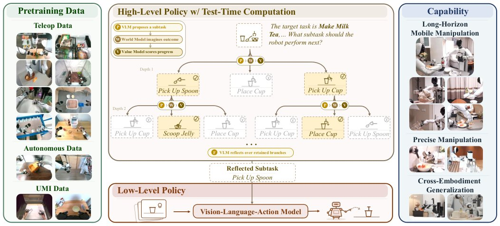

> *Generated by JarvisForResearchers Bot on 2026-08-19*

!!! tip "Why we featured this paper"
    Brand new preprint (2026) — accepted

## TL;DR
$\tau_0$-VLA introduces a hierarchical foundation model for mobile manipulation that employs budget-adaptive Test-Time Computation (TTC) during high-level subtask generation. This TTC leverages a world model to predict terminal states for candidate subtasks, allowing the system to allocate computational resources to consequential decisions, thereby improving long-horizon task success over fixed-budget inference.

## The Problem
Long-horizon robot manipulation necessitates the coherent sequencing of multiple subtasks. Current hierarchical Vision-Language-Action (VLA) models typically execute each high-level decision via a single forward pass. This fixed-budget approach is insufficient because it lacks a mechanism to dynamically allocate additional computation to choices that are difficult or carry significant environmental consequences. Consequently, errors in high-level subtask selection are often only detectable after the execution has already altered the physical state of the environment, leading to failure.

The limitations of prior work are threefold: many hierarchical systems operate with a fixed inference budget, failing to compare alternative subtasks or evaluate them against the physical states they are expected to produce. Action-level search methods only expose local physical consequences, whereas language-only reasoning compares alternatives without grounding them in predicted physical outcomes. Furthermore, existing search mechanisms are constrained to structured scene-graph transitions or discrete manipulation plans, unlike $\tau_0$-VLA, which searches open-ended language subtasks and evaluates them via predicted terminal images.

## Key Contributions
We present $\tau_0$-VLA, a complete VLA system that reframes high-level subtask generation as a compute-scalable inference problem. We maintain a unified low-level control interface capable of supporting diverse robot embodiments. Crucially, we demonstrate that adaptively allocating additional computation to high-level decisions substantially improves next-subtask prediction accuracy and yields higher end-to-end task success on long-horizon real-robot tasks.

## How It Works


*Fig. 1: Overview of τ0-VLA. The high-level policy uses world-model-guided test-time computation to search over subtask
sequences. At each expansion step, a VLM proposes candidate subtasks, a world model predicts their visual outcomes, and
a value model evaluates the resulting task progress. Beam sea*

$\tau_0$-VLA operates on a hierarchy: a high-level policy determines the sequence of subtasks, and a low-level policy executes the chosen subtask. When the high-level policy detects uncertainty, it invokes a budget-adaptive Test-Time Computation (TTC) procedure. This TTC follows a propose-predict-evaluate loop. The Proposal model (P) generates candidate subtasks. The World model (W) then predicts the resulting terminal head-camera image ($\hat{o}$) for each candidate subtask ($z$) starting from the current image ($\tilde{o}$). The Value model (V) scores the quality of this outcome based on the global task instruction ($\ell$), the candidate subtask ($z$), and the predicted terminal image ($\hat{o}$). Promising branches are recursively expanded using beam search based on cumulative scores. Finally, a Reflective model (F) commits to the definitive next subtask ($z^\star_t$). The low-level policy ($\pi_\theta$) then executes $z^\star_t$ using a unified 40-dimensional state and action space.

### High-Level Policy ($\mu$)
The High-Level Policy ($\mu$) is responsible for maintaining the execution memory of the task. Its primary function is to decide when the current state warrants invoking the TTC procedure to generate the next subtask, rather than relying on a standard, fixed-budget inference step.

### Proposal Model (P)
The Proposal Model (P) takes the current execution context, represented by the memory state $h_t$, and generates a direct, initial subtask proposal, denoted as $z_{dir}^t$. This serves as the starting point for the subsequent search process.

### World Model (W)
The World Model (W) is responsible for simulating the consequence of a proposed action sequence. Given an initial image ($\tilde{o}$) and a candidate subtask ($z$), it predicts the resulting terminal head-camera image ($\hat{o}$), formalized as $\hat{o} = W(\tilde{o}, z)$. This prediction grounds the abstract language subtask in a concrete visual outcome.

### Value Model (V)
The Value Model (V) assigns a quality score ($v$) to each candidate subtask. This scoring is conditioned on the global task instruction ($\ell$), the candidate subtask ($z$), and the predicted terminal image ($\hat{o}$), calculated as $v = V(\ell, z, \hat{o})$. This allows for a consequence-aware evaluation before physical execution.

### Reflective Model (F)
The Reflective Model (F) acts as the final decision-maker within the TTC loop. It conditions on the set of retained, high-scoring branches from the beam search and outputs the final committed subtask, $z^\star_t$. Note that $z^\star_t$ is not necessarily restricted to the initial set of candidates generated by P.

### Low-Level Policy ($\pi_\theta$)
The Low-Level Policy ($\pi_\theta$) handles the physical execution. It maps the current observation ($o_t$), the proprioceptive state ($s_t$), and the finalized subtask ($z^\star_t$) to an action chunk spanning $H$ steps, which is output at time $t+H-1$. This policy operates over a unified 40-dimensional state and action space.

## Results
| Metric | Value | Baseline | Source |
| :--- | :--- | :--- | :--- |
| Next-subtask prediction accuracy | substantially improves | whole-task inference using the same low-level policy | Evaluation section |
| End-to-end task success | higher | whole-task inference using the same low-level policy | Evaluation section |

## Why This Matters
The practitioner takeaways highlight several critical advancements. First, for complex, long-horizon tasks, the ability to allocate computational resources adaptively to high-level decision-making via TTC provides a significant performance advantage over systems constrained by fixed inference budgets. Second, the development of a unified low-level control interface, trained on 40,115 hours of heterogeneous data, enables a single model to manage control across various embodiments, including fixed-base, bimanual, and mobile whole-body configurations. Finally, the integration of world model prediction with value-guided beam search enables genuine consequence-aware planning prior to committing to any physical action.

## Limitations & Open Questions
Two limitations were noted during the development and presentation of the work. For brevity in the figure, the paper omits the explicit representation of recursive beam expansion to depth D. Furthermore, the Reflective Model's output is not constrained to be drawn exclusively from the candidate set generated during the search phase, which presents an area for further investigation regarding search space pruning and commitment strategy.

---

## Citation

**Paper:** [2608.16885](https://arxiv.org/abs/2608.16885)

```bibtex
@article{260816885,
  title   = {$τ_0$-VLA: a Hierarchical Robot Foundation Model with World-Model-Guided Test-Time Computation},
  author  = {Xiaowei Cai and Yunuo Cai and Bingao Chen and Jingxiao Chen and Zhi Chen and Siyuan Feng et al.},
  journal = {arXiv preprint arXiv:2608.16885},
  year    = {2026},
  url     = {https://arxiv.org/abs/2608.16885}
}
```
