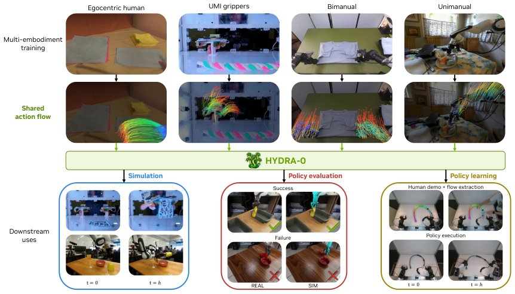

> *Generated by JarvisForResearchers Bot on 2026-08-20*

!!! tip "Why we featured this paper"
    Brand new preprint (2026) — accepted

## TL;DR
Hydra-0 introduces a generalist world model conditioned on action flow, a shared image-plane motion representation, enabling multi-embodiment learning and control across diverse robotic interactions.

## The Problem
The current landscape of foundation world models suffers from a critical lack of transferability. Existing models are frequently coupled to the specific embodiment on which they were trained. This coupling arises because they often rely on native robot commands—such as joint-space or end-effector trajectories—which inherently encode embodiment-specific structural information. This reliance prevents seamless generalization across different robot platforms, tasks, or environments. Furthermore, there is an unresolved challenge in establishing a mechanism to ground a purely visual, shared motion representation into executable, embodiment-specific robot commands.

## Key Contributions
We make three primary contributions to address these limitations. First, we formulate robot action conditioning not through native commands, but via kinematically grounded image-plane action flow. This flow can be derived either from recorded video data or synthesized from executable commands. Second, we demonstrate that this action flow serves as a universal, shared interface for generalist world modeling across various embodiments and video-generation backbones. Empirical evaluation shows significant performance gains: we achieve 90.40% lower robot-motion error and 60.16% lower object-motion error compared to the action-conditioned Cosmos 2.5 baseline. Third, we successfully invert this action flow interface to construct a world action model capable of predicting compatible robot motion directly from desired object flow extracted from human demonstrations.

## How It Works


*Figure 1: Action flow as a shared control interface. Top: Hydra-0 learns from diverse interaction videos
featuring egocentric human demonstrations, handheld UMI grippers, bimanual robot arms, and single-arm
robots. Middle: Visible embodiment motion is represented as image-plane flow trajectories, pl*

Hydra-0 operates by leveraging action flow, defined as a set of camera-plane trajectories, as the primary shared visual condition. In the forward dynamics mode, we simulate executable commands using a platform like Isaac Lab. The resulting visible robot-surface trajectories are then projected into the image plane to construct the action flow $\mathcal{F}$. This $\mathcal{F}$ subsequently conditions a causal autoregressive dynamics model, $g_{\theta}$, which is tasked with predicting the future latent states $\hat{s}_{1:H}$. The motion features are derived by propagating information from the initial state $s_0$ using Gaussian weights to generate a motion condition $C_{motion}$. This $C_{motion}$ is then concatenated with the noisy latent representation $Z_t$ before being processed by the DiT patch embedding layer. The training objective optimizes the standard flow-matching objective $\mathcal{L}(\theta)$, augmented by the inclusion of $C_{motion}$.

### Encoder $e_{\varphi}$
The Encoder $e_{\varphi}$ is responsible for mapping the initial observation $o_0$ into a compact, spatial latent state $s_0 \in \mathcal{S}$. This establishes the initial state representation upon which the dynamics model operates.

### Dynamics Model $g_{\theta}$
The Dynamics Model $g_{\theta}$ is the core predictive component. It takes the initial state $s_0$ and the action flow $\mathcal{F}$ as inputs to predict the sequence of future latent states, $\hat{s}_{1:H} = g_{\theta}(s_0, \mathcal{F})$.

### Decoder $d_{\psi}$
The Decoder $d_{\psi}$ reconstructs the visual sequence corresponding to the predicted latent states. It maps the predicted latent sequence $\hat{s}_{1:H}$ back into the observable RGB sequence, $\hat{o}_{1:H} = d_{\psi}(\hat{s}_{1:H})$.

### Action Flow $\mathcal{F}$
The Action Flow $\mathcal{F}$ is the critical shared interface. It is formally defined as a set of camera-plane trajectories, $\mathcal{F} = \{\tau_n\}_N$, which explicitly describe the commanded motion of visible points on the robot or objects within the scene.

### Motion Feature $M_k(\tilde{p})$
The Motion Feature $M_k(\tilde{p})$ quantifies the propagated motion information at a specific latent time $k$ and a normalized latent-grid location $\tilde{p}$. This is computed by applying Gaussian weighting to the features derived from the initial frame.

### Presence Gate $g_k(\tilde{p})$
The Presence Gate $g_k(\tilde{p})$ serves to delineate where the visual condition carries trajectory-propagated appearance information. It is calculated as the clipped sum of the raw Gaussian weights, providing a spatial mask for motion influence.

### Complete Motion Condition $C_{motion}$
The Complete Motion Condition $C_{motion}$ is the composite input that injects motion context into the latent space. It is constructed by combining the derived motion features and the presence gate: $C_{motion} = (M, g)$.

### Action Head
The Action Head is utilized during the inverse control mode. It functions by reading the clean token features from the DiT structure and learning the necessary embodiment-specific inverse mapping required to translate the abstract latent representation back into executable robot commands.

## Results
| Metric | Value | Baseline | Source |
| :--- | :--- | :--- | :--- |
| robot-motion error | 90.40% lower | action-conditioned Cosmos 2.5 baseline | Section 1 |
| object-motion error | 60.16% lower | action-conditioned Cosmos 2.5 baseline | Section 1 |
| Pearson correlation (replayed vs reference success rates) | r= 0.96 | N/A | Section 1 |

## Why This Matters
The introduction of action flow fundamentally decouples the world model's dynamics from the specific kinematics of the training robot. By using a camera-plane trajectory representation, Hydra-0 achieves a robust, embodiment-agnostic interface. This capability allows the model to ingest and generalize across heterogeneous training data—be it human demonstrations, bimanual tasks, or single-arm operations—without requiring retraining for each new hardware configuration. Furthermore, the dual capability of forward dynamics prediction and inverse control positions Hydra-0 as a comprehensive tool for both simulation-based evaluation and real-world intent-driven robotic execution.

## Limitations & Open Questions
Two primary limitations must be acknowledged. First, the geometry-aware construction route for deriving the action flow necessitates prior knowledge of the robot's geometry and precise camera calibration parameters. Second, the functionality of the Action Head in the inverse mode is contingent upon having paired real-world robot trajectories available during the training phase to learn the necessary embodiment-specific command mapping. Future work should investigate methods to infer or learn these geometric priors implicitly.

---

## Citation

**Paper:** [2608.18077](https://arxiv.org/abs/2608.18077)

```bibtex
@article{260818077,
  title   = {Hydra-0: Action Flow for Generalist World Modeling and Control},
  author  = {Hongyu Li and Bowen Wen and Xinghao Zhu and Yixuan Wang and Yilun Du and Yunzhu Li et al.},
  journal = {arXiv preprint arXiv:2608.18077},
  year    = {2026},
  url     = {https://arxiv.org/abs/2608.18077}
}
```
