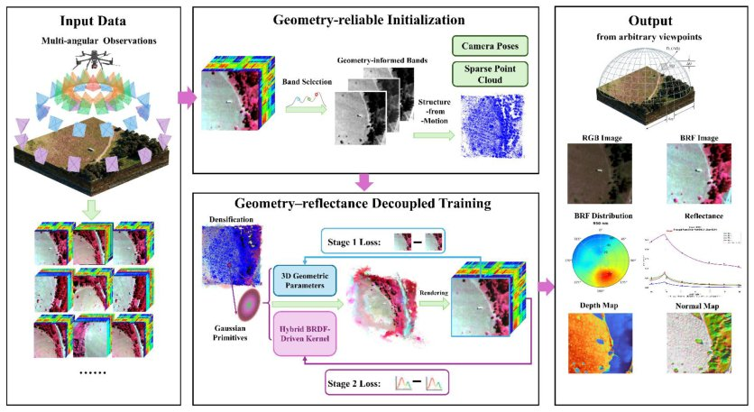

> *Generated by JarvisForResearchers Bot on 2026-09-02*

!!! tip "Why we featured this paper"
    Brand new preprint (2026) — accepted

## TL;DR
BRF-GS is a 3DGS-based framework that integrates a hybrid BRDF-driven kernel, geometry-reliable band selection, and a two-stage training strategy to efficiently model Bidirectional Reflectance Factor (BRF) and generate multi-angle hyperspectral reflectance imagery for remote sensing scenes.

## The Problem
Existing 3D radiative transfer models are computationally intensive and require substantial prior knowledge for scene construction. Concurrently, standard 3D Gaussian Splatting (3DGS) inherently lacks the capability to capture complex directional reflectance due to its low-order spherical harmonics representation. Furthermore, direct extension of 3DGS to hyperspectral data introduces significant challenges related to high dimensionality, maintaining spectral fidelity, and managing varying inter-band signal quality.

The limitations of current approaches are threefold: Microfacet-based BRDF models are insufficient for remote sensing because they fail to account for multi-scale interactions such as 3D structural occlusion, shadowing effects, and multiple scattering. Existing hyperspectral extensions, such as HyperGS and Hyperspectral Gaussian Splatting, either employ latent compression that risks suppressing subtle spectral variations or couple geometry and spectral representations during joint optimization. Finally, there is an insufficient exploration of leveraging band-dependent data quality to selectively utilize geometry-reliable spectral bands for robust 3D scene initialization in hyperspectral BRF modeling.

## Key Contributions
We introduce four primary contributions:
1. A geometry-reliable spectral bands selection strategy for hyperspectral Gaussian initialization, utilizing an Equivalent Feature Count (EFC) to quantify band-wise geometric reliability.
2. A hybrid BRDF-driven kernel representation for Gaussian primitives, integrating Lambertian diffuse reflection, a simplified microfacet-based specular component, volumetric scattering, and geometric-optical effects.
3. A geometry-spectral decoupled two-stage training framework that first optimizes geometry using selected geometry-reliable bands and subsequently learns spectral directional reflectance variations using full hyperspectral observations.
4. The construction and release of the AIR-BRF dataset, a multi-angle hyperspectral directional reflectance dataset comprising three scenes.

## How It Works


*Fig. 1 Overview of the proposed BRF-GS framework. Multi-angle hyperspectral observations are first*

BRF-GS addresses the limitations of standard 3DGS for hyperspectral BRF modeling by introducing three core innovations. First, it employs a geometry-reliable spectral bands selection strategy, quantified by the Equivalent Feature Count (EFC), to ensure robust 3D scene initialization by adaptively selecting geometry-informative bands. Second, it enhances the Gaussian primitives by incorporating a hybrid semi-empirical BRDF kernel, which integrates Lambertian diffuse reflection, a simplified microfacet-based specular component, volumetric scattering, and geometric-optical effects, allowing learnable weights to estimate radiative mechanism contributions. Finally, the framework utilizes a geometry-spectral decoupled two-stage training strategy: geometry parameters are optimized first using the selected reliable bands, followed by spectral directional reflectance learning using the full hyperspectral observations.

### Hybrid BRDF-driven kernel
This kernel is integrated directly into the Gaussian primitives. It is constructed by combining four physical components: Lambertian diffuse reflection, a simplified microfacet-based specular component, volumetric scattering, and geometric-optical effects. Crucially, the framework incorporates learnable weights within this kernel structure, enabling the model to estimate the relative contributions of these various radiative mechanisms during rendering.

### Geometry-reliable spectral bands selection strategy
This strategy addresses the issue of noisy or unreliable spectral data during the initial geometry estimation phase. It jointly considers both the band-wise signal quality and the spatial feature responses across the hyperspectral cube. This assessment is formalized through the Equivalent Feature Count (EFC), which provides a quantitative metric to adaptively select only those spectral bands deemed most informative for robust 3D scene initialization.

### Two-stage training framework
The training process is deliberately decoupled into two sequential stages. In the first stage, the geometric parameters of the Gaussian primitives are optimized exclusively using the subset of bands selected by the Geometry-reliable spectral bands selection strategy. Following this geometric stabilization, the second stage commences, where the full hyperspectral observations are utilized to learn the complex spectral directional reflectance variations, conditioned on the established geometry.

## Results
| Metric | Value | Baseline | Source |
| :--- | :--- | :--- | :--- |
| Spatial fidelity and spectral accuracy | Superior | Not specified | Experimental results |
| BRF response reproduction | Accurately reproducing characteristic view-dependent BRF responses | Not specified | Experimental results |

## Why This Matters
For hyperspectral remote sensing applications, standard 3DGS is fundamentally insufficient because it cannot model the complex, view-dependent directional reflectance inherent in real-world surfaces. Our work demonstrates that employing band-wise data quality assessment, such as the EFC, is a necessary prerequisite for achieving robust 3D scene initialization when dealing with spectrally heterogeneous data. Furthermore, the decoupling of geometry optimization from spectral modeling provides a pathway toward a more physically grounded and computationally stable learning process for accurately modeling the Bidirectional Reflectance Factor.

## Limitations & Open Questions
The current presentation does not provide quantitative comparisons against specific baselines for all metrics, which limits the scope of direct performance benchmarking. Additionally, the complexity introduced by the hybrid BRDF-driven kernel necessitates careful implementation to ensure that the learned parameters maintain physical interpretability. Future work should focus on deriving quantitative comparisons across established state-of-the-art methods and further refining the physical constraints within the kernel structure.

---

## Citation

**Paper:** [2608.31159](https://arxiv.org/abs/2608.31159)

```bibtex
@article{260831159,
  title   = {BRF-GS: Hyperspectral Bidirectional Reflectance Factor Modeling and Image Generation Based on 3D Gaussian Splatting},
  author  = {Yiling Yao and Wenjuan Zhang and Bowen Wang and Bocheng Li and Wentao Song and Bing Zhang},
  journal = {arXiv preprint arXiv:2608.31159},
  year    = {2026},
  url     = {https://arxiv.org/abs/2608.31159}
}
```
