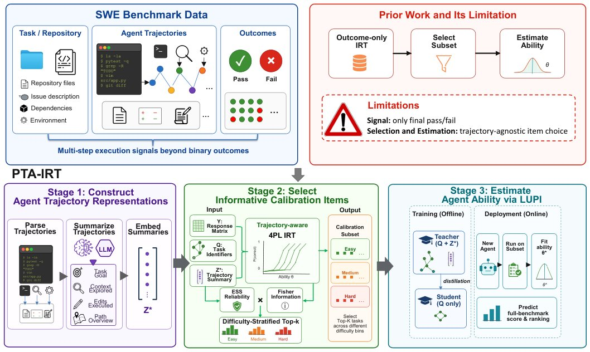

> *Generated by JarvisForResearchers Bot on 2026-09-03*

!!! tip "Why we featured this paper"
    Brand new preprint (2026) — accepted

## TL;DR
PTA-IRT is a Privileged Trajectory-Aware Item Response Theory framework that fuses historical agent execution trajectories with Item Response Theory to enable efficient, budgeted evaluation of software engineering agents. It leverages process-level execution data to enhance the accuracy of performance estimation from limited test sets.

## The Problem
Evaluating software engineering agents on realistic, repository-level benchmarks is substantially expensive due to multi-step code exploration, modification, and test execution. This high cost motivates the need to reliably recover full-benchmark performance from a small, budgeted subset of tasks. Existing efficient evaluation methods are largely result-only, fitting historical pass/fail response matrices or static task semantics. Furthermore, prior IRT methods for efficient benchmarking typically represent each task solely through its final pass/fail response, discarding crucial process-level measurement signals. Current SWE benchmarks still rely on rule-based filtering or human verification to reduce evaluation cost, as seen in SWE-bench Lite and Verified subsets.

## Key Contributions
We make three key contributions. First, we formulate efficient SWE benchmarking as a budgeted subset-to-full evaluation problem under a realistic protocol where new agents are executed only on the calibration subset while historical trajectories are used offline for training. Second, we introduce PTA-IRT, which incorporates historical agent trajectories as privileged information into IRT-based item selection and full-benchmark performance estimation. Third, we demonstrate that PTA-IRT improves budgeted score and ranking recovery over prior IRT baselines across four SWE benchmarks.

## How It Works


*Figure 1: Limitations of prior work and an overview of PTA-IRT.*

PTA-IRT operates in three stages. First, it constructs Agent Trajectory Representations by parsing heterogeneous execution logs into structured process summaries containing Task Goal, Context Explored, Edits Executed, and Path Overview. Second, it selects Informative Calibration Items by fitting a trajectory-aware 4PL IRT model, scoring tasks using a trajectory-aware Fisher information weighted by trajectory reliability, and selecting a difficulty-stratified subset. Third, it estimates Agent Ability via LUPI, where a teacher-student objective transfers privileged process knowledge from historical trajectories to a deployable student model, allowing the student to estimate the new agent's full-benchmark performance from limited calibration observations.

### Trajectory Parser
The Trajectory Parser extracts action steps from heterogeneous logs to build the foundation for structured summaries. This component is responsible for the initial parsing of raw execution data into discrete, actionable steps.

### Summarization Model
The Summarization Model compresses historical trajectories into a structured process summary with four fields: Task Goal, Context Explored, Edits Executed, and Path Overview. This model abstracts the complex temporal dynamics of the agent's execution into a fixed-dimensional, semantically rich representation.

### Agent Encoder
The Agent Encoder is a two-layer multilayer perceptron (MLP) that maps a one-hot agent identifier to latent ability $\theta_i$. This maps the discrete identity of an agent to a continuous latent space representation of its underlying capability.

### Item Encoder
The Item Encoder is a two-layer multilayer perceptron (MLP) that maps a one-hot item identifier to global parameters $(a_j, b_j, c_j, d_j)$. These parameters define the item's characteristics within the IRT framework, such as discrimination and difficulty.

### Summary Encoder
The Summary Encoder is a two-layer multilayer perceptron (MLP) that maps each privileged summary $z_{ij}$ to bounded residuals $(\Delta a_{ij}, \Delta b_{ij})$. This component learns how the specific execution context of an agent on a task modifies the baseline item parameters.

### Teacher Model
The Teacher Model predicts with trajectory-adjusted parameters $(a_{ij}, b_{ij})$ using privileged summary information during offline training. This model utilizes the rich, historical trajectory data to learn a highly accurate, context-specific parameterization of the item response function.

### Student Model
The Student Model predicts with global item parameters $(a_j, b_j, c_j, d_j)$ and estimates ability $\theta^*$ at test time using only identifiers and shared item parameters. This model is designed for deployment, relying only on the generalized item parameters and the agent's identifier, having learned the necessary knowledge transfer from the Teacher Model.

## Results
| Metric | Value | Baseline | Source |
| :--- | :--- | :--- | :--- |
| MAE | $0.041\pm0.015$ | prior IRT baselines | Table 3 |
| Kendall's $\tau$ | $0.888$ | prior IRT baselines | Table 3 |
| Spearman's $\rho$ | $0.973$ | prior IRT baselines | Table 3 |
| $\tau$ | $0.768$ | N/A | Figure 2 |

## Why This Matters
When evaluating complex, multi-step agents, incorporating process-level evidence (like execution trajectories) significantly boosts the reliability of performance estimation from small test sets. PTA-IRT demonstrates robustness, maintaining superior performance across varying calibration budgets (e.g., 5% to 25%). The combination of trajectory-aware IRT for item selection and LUPI for knowledge transfer is a powerful paradigm for efficient model evaluation.

## Limitations & Open Questions
The method relies on the availability of historical agent trajectories for offline training. Furthermore, the process summaries are generated using a summarization model, introducing potential compression artifacts.

---

## Citation

**Paper:** [2609.01603](https://arxiv.org/abs/2609.01603)

```bibtex
@article{260901603,
  title   = {Efficient SWE Agent Benchmarking via Trajectory-Aware Evaluation},
  author  = {Kefeng Duan and Dewu Zheng and Yanlin Wang and Xiwen Wang and Ensheng Shi and Xilin Liu et al.},
  journal = {arXiv preprint arXiv:2609.01603},
  year    = {2026},
  url     = {https://arxiv.org/abs/2609.01603}
}
```
