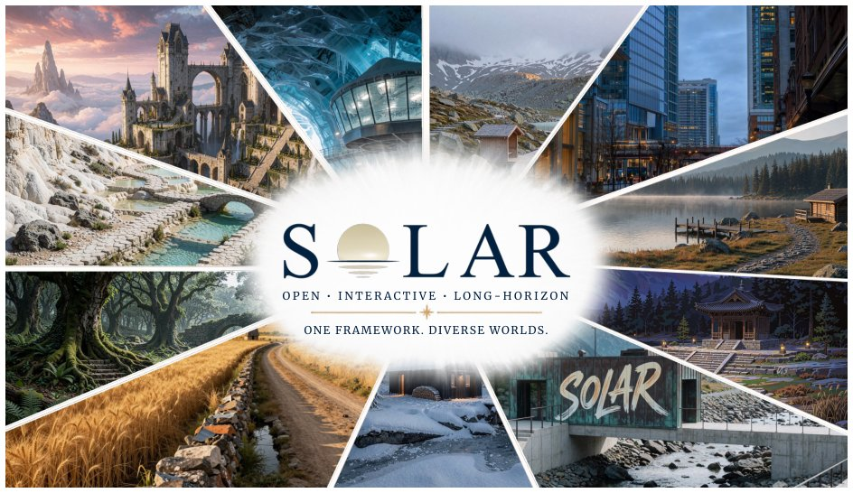

> *Generated by JarvisForResearchers Bot on 2026-09-04*

!!! tip "Why we featured this paper"
    Brand new preprint (2026) — accepted

## TL;DR
SolarWM establishes a unified, open foundation for interactive, long-horizon video world models. It achieves this by standardizing heterogeneous data from 10 datasets into a single, frame-aligned contract via a reconfigurable multi-source data engine. Model adaptation across diverse video backbones is managed by a backbone-native framework, and training is formalized through a three-stage recipe: Bidirectional Adaptation, Teacher-Forced AnyFlow Initialization, and DMD-based Causal Training.

## The Problem
The objective of transitioning video generation models from short-clip synthesis to interactive, long-horizon rollouts necessitates maintaining high visual fidelity and temporal coherence while ensuring responsiveness to external control signals. This transition is fundamentally hampered by two coupled issues: first, the supervision provided by existing datasets is inherently inconsistent due to variations in temporal scale, motion distribution, captioning conventions, and camera geometry; and second, the architectural diversity among state-of-the-art video generation backbones—specifically concerning latent representations, attention mechanisms, and conditioning inputs—precludes straightforward, shared adaptation without degrading the intrinsic capabilities of the pretrained models. Existing open systems fail to address this coupling, often remaining restricted to specific data modalities or model architectures.

## Key Contributions
SolarWM delivers three primary contributions:
1. A fully open and unified foundation that integrates a reconfigurable multi-source data infrastructure with a scalable backbone-native adaptation framework.
2. A reconfigurable multi-source data infrastructure capable of processing approximately 1.43 million clips sourced from 10 distinct datasets, with the corpus and processing pipeline released for reproducibility.
3. A scalable backbone-native adaptation framework and a corresponding model family (SolarWM-wan2.2-5B, SolarWM-wan2.2-14B, SolarWM-ltx-2.5-22B, and SolarWM-minimax-h3-33B) trained using a formalized three-stage procedure.

## How It Works


*Figure 1 | SolarWM: an open foundation for interactive, long-horizon video world models.*

SolarWM addresses data heterogeneity at the input layer using the Reconfigurable Multi-Source Data Engine. This engine transforms disparate data—including visual observations, metric camera geometry, captions, quality metadata, selection decisions, and provenance—into a singular, frame-aligned contract. Model adaptation is then managed by the Backbone-Native Adaptation Framework, which ensures that while shared interfaces exist for camera conditioning and long-horizon rollout, the native representations and optimization objectives of the underlying video generators are preserved. The training procedure itself is structured as a sequential, three-stage recipe to guide the model from general feature learning to precise causal generation.

### Reconfigurable Multi-Source Data Engine
This component is responsible for the ingestion and harmonization of heterogeneous data. Its function is to map inputs from various sources—which may differ in temporal resolution, geometric representation, or descriptive style—onto a canonical, unified data structure. This structure serves as the consistent input contract for the subsequent model training stages, effectively decoupling the model training process from the idiosyncrasies of the source datasets.

### Backbone-Native Adaptation Framework
This framework is designed to facilitate cross-architecture compatibility. It abstracts the necessary interfaces—specifically for camera conditioning and the mechanism enabling long-horizon rollout—while strictly preserving the internal computational graphs and learned representations of the specific video generator being adapted. This allows the system to leverage the strengths of diverse pretrained backbones without requiring a monolithic, architecture-specific redesign.

### Bidirectional Adaptation (Stage 1)
The initial training stage focuses on robust feature learning using bidirectional attention. The objective function, $L_{bid}$, is minimized:
$$L_{bid} = \mathbb{E}_{(\mathbf{z}_t, \mathbf{z}_{t+1}, c)} \left[ \langle \text{Decoder}(\mathbf{z}_t, \mathbf{z}_{t+1}, c) - \mathbf{z}_{t+1} \rangle^2 \right]$$
This stage utilizes bidirectional attention across the entire training window. Crucially, camera control is injected into the latent space via a fused-PRoPE mechanism, providing early exposure to control signals before the model commits to a unidirectional prediction path.

### Teacher-Forced AnyFlow Initialization (Stage 2)
Stage 2 transitions the model toward autoregressive generation. The attention mechanism is switched to causal, and the objective shifts to minimizing $L_{TF-AF}$:
$$L_{TF-AF} = \mathbb{E}_{(\mathbf{z}_t, \mathbf{z}_{t+1}, c)} \left[ \text{AF}(\mathbf{z}_t; \mathbf{z}_{t+1}, c, \mathbf{z}_{<t}, c) \right]$$
Teacher forcing is employed here. By conditioning the model on the ground-truth future states ($\mathbf{z}_{t+1}$), the model learns the necessary transition dynamics under causal constraints, enabling the initial steps of autoregressive generation without immediately requiring perfect self-prediction.

### DMD-based Causal Training (Stage 3)
The final stage refines the causal generator using trajectories generated by the model itself. Instead of relying solely on ground-truth supervision, the model is trained to align its generated distribution with the dynamics implied by its own predictions. This is achieved by minimizing the DMD Loss on model-generated trajectories, effectively stabilizing the long-horizon inference process by enforcing consistency with the learned dynamics model.

## Results
| Metric | Value | Baseline | Source |
| :--- | :--- | :--- | :--- |
| Model Family | SolarWM-wan2.2-5B, SolarWM-wan2.2-14B, SolarWM-ltx-2.5-22B, and SolarWM-minimax-h3-33B | N/A | Abstract |
| Rollout Horizon | minutes to hours | 5s sequences (training) | Abstract |

## Why This Matters
SolarWM provides a critical methodological shift for the field of interactive world modeling. By formalizing a unified data contract, it mitigates the practical engineering hurdle of combining disparate, real-world datasets. Furthermore, the backbone-native adaptation framework decouples the training methodology from the specific implementation details of the video generator, offering a path toward genuinely scalable research. The three-stage training recipe demonstrates that high-fidelity, long-horizon performance can be achieved by systematically progressing from bidirectional feature learning to constrained causal prediction, even when the initial training data is limited to short clips.

## Limitations & Open Questions
One limitation noted is that the paper does not provide specific quantitative performance metrics against established baselines for the final long-horizon rollouts; it only asserts state-of-the-art performance. Additionally, while the fused-PRoPE mechanism is described as a method for injecting camera control, the precise implementation overhead associated with this mechanism remains insufficiently detailed for a complete engineering assessment. Future work should focus on quantifying the computational cost of the data engine and providing explicit comparative performance curves across different rollouts.

---

## Citation

**Paper:** [2609.02886](https://arxiv.org/abs/2609.02886)

```bibtex
@article{260902886,
  title   = {SolarWM: Open Data and Scalable Training for Long-Horizon Video World Models},
  author  = {Junchao Huang and Guian Fang and Shengju Qian and Xianghao Kong and Zhuoran Zhao and Wei Huang et al.},
  journal = {arXiv preprint arXiv:2609.02886},
  year    = {2026},
  url     = {https://arxiv.org/abs/2609.02886}
}
```
