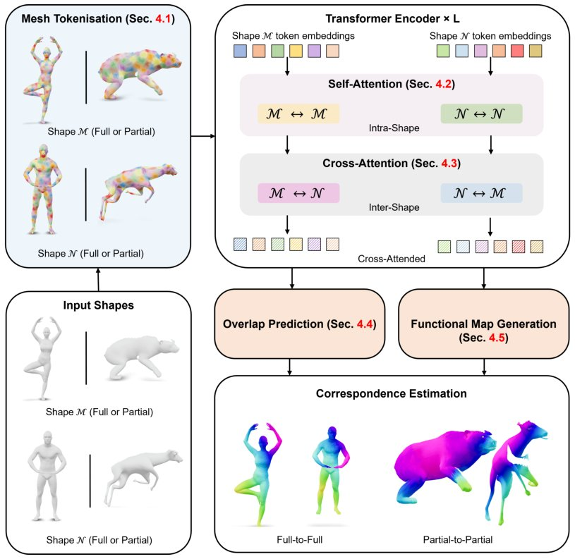

> *Generated by JarvisForResearchers Bot on 2026-09-05*

!!! tip "Why we featured this paper"
    Brand new preprint (2026) — accepted

## TL;DR
TokenMatch introduces a novel, feed-forward, transformer-based unified model for 3D shape correspondence estimation. It addresses the limitations of prior methods by employing curvature-guided tokenization to handle irregularly sampled meshes, followed by self- and cross-attention mechanisms to learn dense correspondences without relying on templates.

## The Problem
Robustly matching 3D shapes is a non-trivial problem, particularly when dealing with partial observations or significant non-isometric deformations. Current learning-based solutions often exhibit deficiencies: they frequently depend on hand-crafted descriptors, rely on rigid template-based representations, or incur prohibitively high inference costs while maintaining limited interpretability. Specifically, existing functional map frameworks struggle with fine-grained correspondence recovery due to their inherent global low-rank structure. Furthermore, reliably inferring both pointwise correspondences and the precise overlapping regions is difficult when only partial shapes are provided, a challenge that generative models over functional maps have failed to address efficiently or interpretably.

## Key Contributions
We present three primary contributions:
1. TokenMatch, the first mesh-transformer-based unified model for 3D shape correspondence estimation, which integrates functional maps with sophisticated self- and cross-attention mechanisms.
2. A curvature-guided, geometry-aware, overlapping mesh tokenisation scheme that permits the application of transformer-based processing to irregularly sampled geometric data.
3. A feed-forward architecture that achieves sub-second inference time for partial-shape matching without necessitating shared templates or making category-specific assumptions.

## How It Works


*Figure 1: Overview of TokenMatch, our unified model for 3D mesh correspondence estimation.
Given a pair of input meshes (bottom-left), we extract geometry-aware tokens (top-left; Sec. 4.1)
and process them with a transformer encoder to obtain shape features (top-right; Secs. 4.2 and 4.4).
Cross-atte*

TokenMatch operates by transforming the continuous geometric structure of 3D meshes into a discrete sequence of tokens suitable for transformer processing. This process begins with geometry-aware tokenization, which partitions the mesh into overlapping patches guided by a signal $s(i) = \alpha \|H(i)\|^2 + (1 - \alpha)E(i)$. These patches serve as the input tokens. These tokens are then fed into a transformer encoder to derive contextualized shape features. To facilitate the reasoning required for dense correspondence, cross-attention is employed to enable feature exchange between the tokens originating from the two input shapes. The framework further incorporates an Overlap Prediction Module to identify shared regions, culminating in the Functional Map Estimation stage, which estimates pointwise correspondences in a reduced spectral basis, thereby unifying the handling of both full and partial shape matching in a template-free, feed-forward manner.

### Geometry-Aware Curvature-Guided Mesh Tokenisation
This component is responsible for discretizing the continuous mesh structure into a set of discrete tokens. It partitions the triangular mesh into overlapping regions. The selection of these regions is not arbitrary; it is guided by the signal $s(i) = \alpha \|H(i)\|^2 + (1 - \alpha)E(i)$, where $\|H(i)\|^2$ quantifies local curvature and $E(i)$ likely relates to edge or feature density. This curvature-weighted approach ensures that tokens are sampled in regions of geometric significance, which is critical for maintaining local geometric fidelity during tokenization.

### Transformer Encoder
The Transformer Encoder receives the tokens generated by the tokenization stage. Its function is to process these tokens and learn rich, contextualized shape features. The architecture utilizes a Multi-Layer Perceptron (MLP) to project the aggregated features into the final token representations, denoted as $x_i = e_i + p_i$, where $e_i$ and $p_i$ represent the embedded and projected features, respectively. This encoding step allows the model to capture long-range dependencies and global shape characteristics from the local patch representations.

### Cross-Attention
This mechanism is the core component enabling the model to reason about dense correspondence between two input shapes. It explicitly facilitates the exchange of features between the token sets derived from the two different input shapes. By allowing tokens from Shape A to query and attend to tokens from Shape B (and vice-versa), the model can learn cross-shape relationships necessary for estimating dense correspondences, moving beyond simple feature similarity.

### Overlap Prediction Module
Following the feature extraction via the Transformer Encoder and Cross-Attention, the Overlap Prediction Module takes the resulting contextualized features. Its objective is to predict the regions where the two input shapes spatially coincide. This prediction is crucial for constraining the correspondence estimation, particularly in the context of partial shapes, by explicitly identifying the valid domain for correspondence mapping.

### Functional Map Estimation
This is the final stage of the pipeline. Utilizing the refined, context-aware features and the guidance from the Overlap Prediction Module, this module estimates the pointwise correspondences. These correspondences are not outputted as raw coordinate mappings but are represented within a reduced spectral basis, which is the characteristic output of a functional map framework. This spectral representation provides a compact, structured way to encode the dense correspondence field.

## Results
| Metric | Value | Baseline | Source |
| :--- | :--- | :--- | :--- |
| Performance | consistently high performance | existing methods | Abstract |
| Inference Speed | sub-second inference speeds | combinatorial techniques and when no additional assumptions are made | Abstract |

## Why This Matters
The development of TokenMatch provides a significant advancement in 3D shape matching by unifying the treatment of full and partial shapes within a single, efficient, and template-free framework. By replacing reliance on fixed descriptors or iterative optimization with a geometry-aware, feed-forward transformer architecture, we achieve both high performance and practical inference speed. The curvature-guided tokenization strategy is particularly valuable as it provides a robust mechanism for handling the inherent irregularity of mesh data, a common scenario in real-world 3D sensing.

## Limitations & Open Questions
The current implementation is constrained by its reliance on the BeCoS dataset for training, meaning its generalization outside of this specific, curated domain requires further validation. Additionally, while the functional map estimation provides a powerful representation of correspondence, the spectral nature of this representation introduces a layer of complexity, and the full interpretability of the learned spectral coefficients remains an active area for investigation.

---

## Citation

**Paper:** [2609.04202](https://arxiv.org/abs/2609.04202)

```bibtex
@article{260904202,
  title   = {TokenMatch: 3D Mesh Correspondence Transformer with Curvature-Guided Tokenisation},
  author  = {Adeela Islam and Zorah Lähner and Vittorio Murino and Vladislav Golyanik},
  journal = {arXiv preprint arXiv:2609.04202},
  year    = {2026},
  url     = {https://arxiv.org/abs/2609.04202}
}
```
