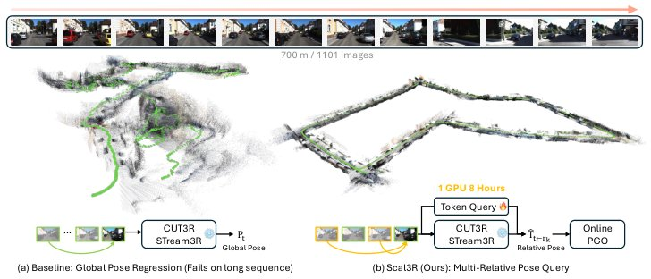

> *Generated by JarvisForResearchers Bot on 2026-09-06*

!!! tip "Why we featured this paper"
    Brand new preprint (2026) — accepted

## TL;DR
Scal3R addresses the catastrophic drift in long-sequence 3D reconstruction by reformulating global pose regression into a multi-reference relative pose query problem, leveraging lightweight tokens injected into a frozen backbone and stabilized by online Pose-Graph Optimization (PGO).

## The Problem
Online 3D reconstruction models exhibit significant performance degradation when processing long video sequences. The fundamental issue stems from the reliance on regressing camera poses relative to a fixed first-frame anchor. This forces the model to extrapolate far outside the distribution of its training data for subsequent frames, which inevitably leads to accumulated drift and geometric collapse, even when the per-frame depth estimation remains locally accurate.

The limitations of prior work are clear: feed-forward models such as CUT3R and STream3R rely on absolute global pose regression, making them susceptible to extrapolation failure over extended sequences. While some existing methods address long-sequence consistency, they typically sacrifice the real-time, online capability by requiring offline global optimization. Furthermore, previous approaches have not effectively utilized prompt tuning techniques to guide relative pose estimation within the context of 3D reconstruction for scalable, drift-free motion representation.

## Key Contributions
We present three primary contributions to address these limitations. First, we identify that the instability arises specifically from global extrapolation errors, whereas the local geometric representations derived by the backbone remain robust. Second, we propose Scal3R, which introduces multi-reference relative pose querying. This is achieved by employing visual prompt tuning on a frozen backbone, utilizing asymmetric attention injection to enable pose tokens to query features from multiple historical reference frames. Third, we integrate this multi-reference querying mechanism with an online Pose-Graph Optimization (PGO) framework, which incorporates keyframe selection and loop closure detection to effectively suppress long-range drift across kilometer-scale trajectories.

## How It Works


*Fig. 1: Scal3R enables scalable online 3D reconstruction on long video
streams. (a) Existing feed-forward models, such as CUT3R [82] and STream3R [40],
regress absolute global poses (Pt) relative to a fixed first frame. This forces extrapolation
far beyond its training distribution, resulting in cat*

Scal3R fundamentally reframes the task of online 3D reconstruction. Instead of predicting the absolute pose $T_t$ relative to $T_0$, it predicts a sequence of relative transformations $\hat{T}_{t \leftarrow r_k}$ between the current frame $t$ and several selected historical reference frames $r_k$. This is achieved by building upon established frozen backbones, such as CUT3R or STream3R.

### Frozen Online 3D Reconstruction Backbones
These are pretrained models (e.g., CUT3R or STream3R) that provide the necessary rich spatiotemporal geometric priors for the reconstruction task. Crucially, the weights of these backbones are held constant throughout the operation, ensuring that the system leverages existing, robust feature extraction capabilities without the computational overhead or instability of fine-tuning the entire network.

### Lightweight Learnable Tokens
To facilitate the relative pose querying, we introduce a small set of learnable tokens. These tokens constitute only about $\sim 1\%$ of the total model parameters and are injected directly into the frozen decoder structure. Their function is to act as specialized, trainable pose queries that guide the feature extraction process toward predicting relative motion.

### Asymmetric Attention Injection
The core mechanism for multi-reference querying is the asymmetric attention injection. In this setup, the pose query tokens ($\tilde{\mathbf{q}}_k$) are used as the query input when attending to the image tokens ($\mathbf{X}^\ell$). Conversely, the image tokens compute their Keys and Values without attending back to the pose query tokens. This asymmetry is critical because it allows the pose tokens to selectively probe historical image features for pose estimation while preserving the integrity and fidelity of the underlying image feature representations within the backbone.

### Pose Token Buffer
To enable the multi-reference querying capability, we maintain a Pose Token Buffer. This buffer stores the camera tokens corresponding to a set of selected past keyframes. This buffer serves as the repository from which the pose query tokens can retrieve relevant historical visual context for calculating relative poses.

### Relative Pose Head
The output of the attention mechanism, which is conditioned on the historical context retrieved from the Pose Token Buffer, is passed to a lightweight MLP head. This head is responsible for decoding the processed pose query tokens ($\tilde{\mathbf{q}}_k$) into the predicted relative transformation $\hat{T}_{t \leftarrow r_k}$, which belongs to the special Euclidean group $SE(3)$.

### Online Pose-Graph Optimization (PGO)
The pairwise relative constraints predicted by the Relative Pose Head are inherently local. To achieve global consistency across long sequences, these constraints are aggregated using an online Pose-Graph Optimization (PGO) framework, specifically implemented via iSAM2. This framework incrementally updates the global trajectory by incorporating new relative measurements, effectively suppressing the accumulation of drift over long distances.

### Keyframe Selection
To manage the computational load and maintain relevance in the Pose Token Buffer, we employ an online 3D overlap-based strategy for keyframe selection. This strategy utilizes a KD-tree spatial index to efficiently determine whether an incoming frame contributes novel geometry to the scene. Only frames deemed geometrically novel are used to update the KV cache and populate the pose token buffer.

### Loop Closure
To correct for accumulated drift over very long trajectories, we incorporate a Loop Closure mechanism. This is implemented by detecting revisits using a pretrained DINOv2 backbone coupled with a SALAD aggregation layer. Upon detecting a revisit, the archived camera token corresponding to the revisited keyframe is injected into the system as an additional, high-confidence reference slot, providing a strong global constraint for the PGO.

## Results
| Metric | Value | Baseline | Source |
| :--- | :--- | :--- | :--- |
| Average ATE reduction | over 60% | online baseline | Abstract |
| Convergence time | 8 hours | N/A | Abstract |

## Why This Matters
The shift from absolute global pose regression to multi-reference relative pose querying is a necessary architectural change for achieving robust, long-sequence 3D reconstruction. By adopting parameter-efficient tuning methods like prompt tuning, Scal3R allows us to leverage the powerful feature extraction capabilities of large, frozen foundation models without incurring the prohibitive cost of full model retraining. Critically, the combination of local relative constraint prediction with a global optimization layer (PGO) is what enables the system to maintain geometric consistency across trajectories spanning kilometers.

## Limitations & Open Questions
The current implementation necessitates an online inference backend, specifically the PGO and loop closure modules, to successfully aggregate the locally predicted relative constraints into a globally coherent trajectory. Furthermore, to manage memory constraints and mitigate feature degradation associated with unbounded state growth, the frozen decoder's streaming state is periodically reset every $N_{reset}$ frames. Future work should investigate methods to stabilize the streaming state across resets while maintaining global consistency.

---

## Citation

**Paper:** [2609.04201](https://arxiv.org/abs/2609.04201)

```bibtex
@article{260904201,
  title   = {Scal3R: Learning Efficient Multi-Relative Pose Query for Scalable Online 3D Reconstruction},
  author  = {Chin-Yang Lin and Yang-Che Sun and Cheng Sun and Fu-En Yang and Min-Hung Chen and Yen-Yu Lin et al.},
  journal = {arXiv preprint arXiv:2609.04201},
  year    = {2026},
  url     = {https://arxiv.org/abs/2609.04201}
}
```
