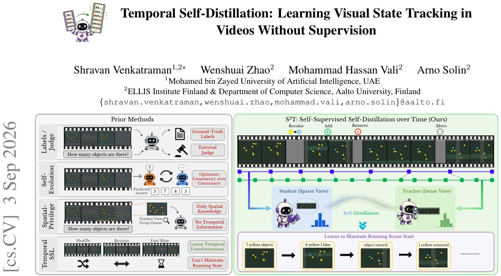

> *Generated by JarvisForResearchers Bot on 2026-09-07*

!!! tip "Why we featured this paper"
    Brand new preprint (2026) — accepted

## TL;DR
S3T introduces a fully self-contained framework that uses temporal sampling density as privileged information to enable continuous visual state tracking in videos without relying on external labels or judges. It achieves this by distilling knowledge from a dense temporal view (Teacher) to a sparse temporal view (Student) using a fixed probe question, resulting in measurable improvements on VSTAT and MVBench benchmarks.

## The Problem
Visual state tracking remains a major limitation in Video Large Language Models (Video-LLMs). These models are required to maintain accurate running counts and scene states as objects undergo dynamic changes—addition, removal, movement, or occlusion—over the duration of a video. Current state-of-the-art open-source models on benchmarks like VSTAT achieve only 34%–35% accuracy when compared to human performance of 90.5%.

Existing approaches suffer from several constraints. Prior methods typically necessitate reliance on ground-truth labels or external human judges. Furthermore, many existing techniques optimize for consistency without rigorously verifying the correctness of the tracked state. Finally, prior work has often been limited to utilizing only spatial privileged views or focusing on learning temporal transformations rather than explicitly modeling persistent scene state.

## Key Contributions
We make three primary contributions:
1. We introduce temporal sampling density as privileged information for self-distillation in Video-LLMs, enabling supervision from unlabeled videos without requiring external annotations or reward models.
2. We propose S3T, the first fully self-contained self-distillation framework for Video-LLMs that demonstrably improves cumulative-state reasoning while maintaining general video-understanding performance.
3. We demonstrate that the cumulative-state tracking capability learned from unlabeled synthetic clips successfully transfers to real-world video, significantly improving performance on VSTAT-YouTube and MVBench Action Count without requiring retraining on real data.

## How It Works


*Figure 1. S3T uses temporal sampling density as self-supervision for visual state tracking. Prior methods (left) rely on labels or
external judges, optimize consistency without verifying correctness, use only spatial privileged views, or learn temporal transformations
rather than persistent scene st*

S3T leverages temporal sampling density as privileged information by sampling a single video clip into two distinct views over the same temporal span: a sparse view ($k_s=12$ frames) and a dense view ($k_t=24$ frames). The dense view is designated as the Teacher, and the sparse view serves as the Student. Both views process the input through the same frozen base model ($f_\theta$), which is augmented with a single, trainable LoRA adapter ($\phi$).

The Student is trained to match the next-token distribution generated by the Teacher. This target distribution is self-generated by passing the Teacher's output through a fixed probe question ($q$). The overall objective function $\mathcal{L}$ is a combination of two terms: the Jensen-Shannon Divergence (JSD) distillation term ($d_{pos}$), which enforces matching the Teacher's distribution, and an anchor term ($d_{ref}$), which regularizes the Student's adapter to remain close to the original base model. The final objective is $\mathcal{L} = d_{pos} + \beta d_{ref}$.

### Frozen Base Model ($f_\theta$)
This is the underlying Video-Language Model whose parameters ($\theta$) are held constant throughout the training process. This ensures that the core general video understanding capabilities of the pre-trained model are preserved.

### Trainable LoRA Adapter ($\phi$)
A single, lightweight adapter is applied to the frozen base model. This adapter ($\phi$) is the only set of parameters updated during training, allowing the model to learn the specific task of state tracking via distillation without catastrophic forgetting of its general knowledge.

### Sparse View (Student)
This view consists of a uniform set of $k_s=12$ frames sampled from the input clip. This view is the active component during training, as it carries the gradients derived from the distillation loss.

### Dense View (Teacher)
This view consists of a uniform set of $k_t=24$ frames sampled from the identical temporal span as the sparse view. The Teacher's output is used to generate the supervisory signal, but its parameters are detached from the gradient flow, serving as a fixed, richer target.

### Probe Question ($q$)
This is a fixed question that is shared across both the Student and Teacher views. It serves as the mechanism to generate the self-supervised targets, allowing the model to reason about the state change implied by the temporal sampling density without external supervision.

### Distillation Term ($d_{pos}$)
This term quantifies the divergence between the Teacher's next-token distribution, $P^{(k_t)}$, and the Student's next-token distribution, $P^{(k_s)}$. Specifically, $d_{pos} = \text{JSD}(\text{sg}[P^{(k_t)}] \parallel P^{(k_s)})$. The use of $\text{sg}[\cdot]$ (stop gradient) on the Teacher's output ensures that the distillation process is driven by the Teacher's learned representation, not its gradient path.

### Anchor Term ($d_{ref}$)
This term acts as a regularization constraint. It measures the JSD between the Student's distribution, $P^{(k_s)}$, and the distribution $P_{ref}$ generated by the original base model ($f_\theta$) when processing the same sparse view. Formally, $d_{ref} = \text{JSD}(\text{sg}[P_{ref}] \parallel P^{(k_s)})$. This prevents the LoRA adapter from drifting too far from the base model's inherent capabilities.

## Results
The application of S3T yields measurable improvements across state tracking and general video understanding tasks:

| Metric | Value | Baseline | Source |
| :--- | :--- | :--- | :--- |
| VSTAT accuracy (S3T) | 37.44 | 34.74 | Section 4.1 |
| VSTAT accuracy (S3T, souping) | N/A | N/A | Section 4.1 |
| VSTAT-YouTube cumulative-state questions improvement | +7.95 | N/A | Section 4.1 |
| MVBench Action Count improvement | +4.50 | N/A | Section 4.1 |

## Why This Matters
The S3T framework provides a pathway to significantly advance Video-LLMs in complex reasoning tasks like state tracking without incurring the substantial cost of large-scale, manually labeled datasets or complex reward engineering. By treating temporal sampling density as an intrinsic, privileged signal, we create a fully self-contained distillation loop. The successful transfer of capabilities from synthetic training environments to real-world benchmarks validates the robustness of this self-supervision mechanism for cumulative state reasoning.

## Limitations & Open Questions
The current implementation is constrained by its reliance on a fixed pool of 300 unlabeled clips generated by the StateGen process. Furthermore, the stability of the training objective is sensitive to the tuning of the anchor weight $\beta$; maintaining this weight requires a specific update rule designed to keep the anchor term $d_{ref}$ near a target value $\kappa$. Future work should investigate adaptive scheduling for $\beta$ or explore methods to generalize the synthetic clip generation process.

---

## Citation

**Paper:** [2609.04203](https://arxiv.org/abs/2609.04203)

```bibtex
@article{260904203,
  title   = {Temporal Self-Distillation: Learning Visual State Tracking in Videos Without Supervision},
  author  = {Shravan Venkatraman and Wenshuai Zhao and Mohammad Hassan Vali and Arno Solin},
  journal = {arXiv preprint arXiv:2609.04203},
  year    = {2026},
  url     = {https://arxiv.org/abs/2609.04203}
}
```
