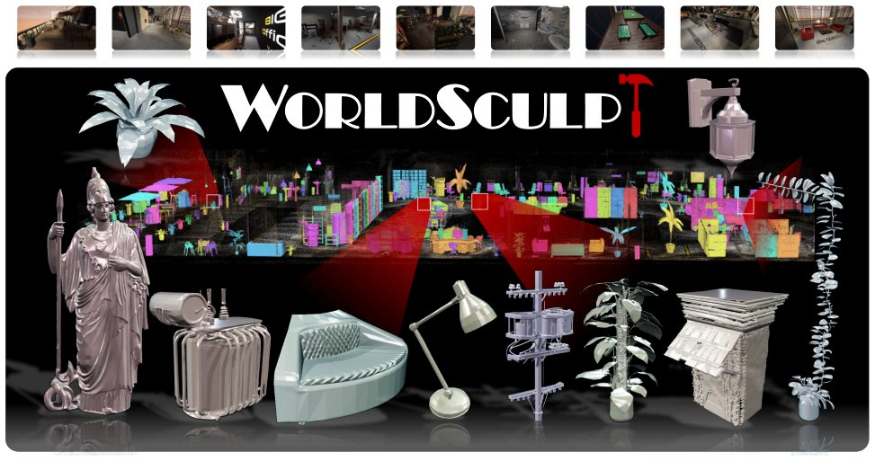

> *Generated by JarvisForResearchers Bot on 2026-09-08*

!!! tip "Why we featured this paper"
    Brand new preprint (2026) — accepted

## TL;DR
WorldSculpt generates compositional 3D representations of densely cluttered scenes by adapting a single-object 3D generative prior (Pixal3D) with a multi-view conditioning pathway, allowing generalization to complex scenes without scene-level training.

## The Problem
Generating a compositional 3D representation of a cluttered scene containing hundreds of objects, where the scene must be represented as a collection of individual object meshes placed in a shared world frame, is challenging due to heavy occlusion and the limitations of existing methods.

Existing approaches suffer from several limitations. Geometry-based methods typically reconstruct the scene as a single representation and leave incomplete geometry in occluded regions. Scene-level world generation models, such as Marble, produce a unified scene representation without explicitly separating individual objects. Furthermore, native-3D generative priors are generally designed for a single pose-free image of one object and do not jointly condition on a consistent set of views or generate objects in a known scene coordinate frame.

## Key Contributions
We introduce three primary contributions. First, we propose WorldSculpt, a framework that maps multi-view scene observations into an anchor-aligned canonical frame, conditions a strong object-level 3D generative prior on the aligned observations, and places the generated meshes into a shared world frame. Second, we demonstrate that a generative prior finetuned entirely on individual objects in canonical space can generalize to large-scale scenes containing hundreds of densely occluded objects, without any scene-level training, through multi-view conditioning and a targeted augmentation curriculum. Third, we introduce UE-MeshyScene, a photorealistic benchmark of densely cluttered scenes containing hundreds of objects, with exact per-object annotations and ground-truth meshes.

## How It Works


*Figure 1 WorldSculpt. Given a set of RGB images with instance-level 2D masks and 3D bounding boxes, WorldSculpt
produces a compositional mesh representation for very complex scenes consisting of hundreds of individual objects.*

WorldSculpt operates in three sequential steps: anchor-aligned object canonicalization, multi-view conditioned object generation, and world frame transformation. For each object, an anchor-aligned virtual canonical cube is constructed. Per-view DINOv3 features are then lifted into this canonical voxel volume using crop-aware projections. These lifted features are aggregated using an IBRNet-style module to form a 3D conditioning grid $G_k$. This grid, alongside global tokens derived from the anchor view, conditions the frozen Pixal3D prior via zero-initialized projection layers and LoRA adaptation. The resulting canonical mesh is subsequently placed into the shared world frame using its canonical-to-world transformation, yielding an individually addressable mesh.

### Anchor-aligned virtual canonical cube
This component defines a normalized cubic domain $V = [-1/2, 1/2]^3$ constructed for each object. Crucially, the orientation of this cube is determined by the anchor camera view, providing a consistent local coordinate system for the object regardless of its initial pose estimation.

### Per-view DINOv3
We employ Per-view DINOv3 to independently encode each canonical observation $\bar{I}_{kn}$. This process yields a dense feature map $F_{kn}$ for each view $n$ associated with object $k$.

### Canonical voxel feature lifting
This step involves sampling the 2D feature map $F_{kn}$ at the projected image location $\pi_{kn}(x)$ for every canonical voxel $x$. This yields the per-view feature contribution $g_n(x)$ for that voxel.

### IBRNet-style module
This module functions as a permutation-invariant aggregator. It computes the cross-view mean $\mu(x)$ and variance $\sigma^2(x)$ across all available views for a given voxel $x$. These statistics are used to refine the final voxel feature $g_{out}(x)$.

### Pixal3D prior
This is the native-3D generative model, which is built upon the TRELLIS.2 structured-latent backbone. It is kept frozen throughout the generation process, serving as the foundational knowledge for object geometry synthesis.

### Low-rank adapters (LoRA)
LoRA is utilized to adapt the pretrained Pixal3D network. Specifically, it modifies the network's attention and per-block projection layers, allowing the frozen prior to effectively exploit the rich, multi-view evidence provided by the scene observations.

## Results
| Metric | Value | Baseline | Source |
| :--- | :--- | :--- | :--- |
| Performance | consistently outperforms prior approaches | prior approaches | Across single-object, controlled multi-object, and UE-MeshyScene evaluations |

## Why This Matters
The core takeaway is that compositional 3D generation can be achieved by conditioning strong single-object priors on multi-view evidence, thereby bypassing the necessity of training a model specifically on scene-level data. Furthermore, the reliance on canonical frames and similarity transformations ensures a consistent object representation even when the initial localization box estimates contain inaccuracies. The introduction of specialized benchmarks like UE-MeshyScene is critical for establishing rigorous evaluation standards for compositional generation under realistic, high-occlusion scenarios.

## Limitations & Open Questions
Currently, the method focuses exclusively on geometry generation; the subsequent stages involving texture and material synthesis remain open problems for future work. Additionally, it is worth noting that the initial coarse localization box $Bloc_k$ is not directly used as the generation volume; instead, we rely on the construction of the anchor-aligned virtual canonical cube.

---

## Citation

**Paper:** [2609.05416](https://arxiv.org/abs/2609.05416)

```bibtex
@article{260905416,
  title   = {WorldSculpt: Generating Compositional Worlds from Grounded Videos},
  author  = {Muyao Niu and Jixuan He and Ruihan Yu and Lian Fu and Yonghao Yu and Zheng-Hui Huang et al.},
  journal = {arXiv preprint arXiv:2609.05416},
  year    = {2026},
  url     = {https://arxiv.org/abs/2609.05416}
}
```
