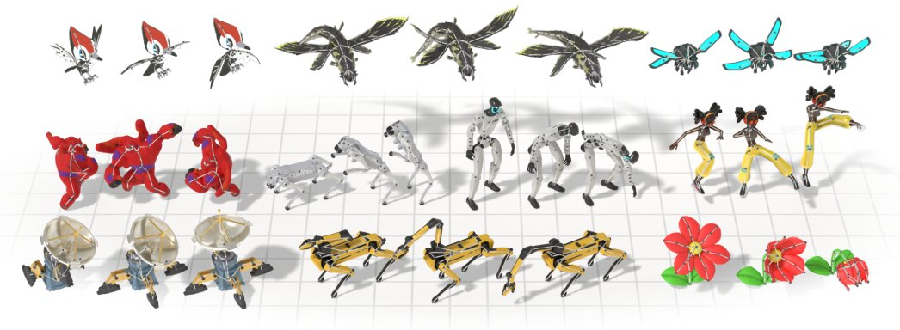

> *Generated by JarvisForResearchers Bot on 2026-09-09*

!!! tip "Why we featured this paper"
    Brand new preprint (2026) — accepted

## TL;DR
UniMate is a unified foundation model that synthesizes articulated motion for skeletons of arbitrary topology from a rigged 3D asset and a text prompt by employing a Topology-Aware Diffusion Transformer (TADiT).

## The Problem
Generating high-quality, controllable motion to drive 3D assets remains a significant bottleneck in computer graphics and robotics. Existing learned animation systems suffer from severe limitations. Specifically, they are typically topology-constrained, meaning they are trained on and restricted to specific anatomical categories or templates. To deploy these systems on novel skeletons, one often requires computationally expensive per-skeleton fine-tuning or the provision of reference motion data at inference time. Furthermore, mesh-based approaches often necessitate costly per-asset distillation or resort to regressing kinematically unconstrained vertex-wise deformations, which introduces instability. Closest prior work, such as AnyTop, is restricted to a small animal corpus, mandates the availability of motion data for the target skeleton during inference, and lacks text conditioning capabilities.

## Key Contributions
We introduce UniMate, a unified foundation model capable of synthesizing articulated motion for skeletons of arbitrary topology, conditioned jointly on a rigged 3D asset and a natural language text prompt. Our primary technical contribution is the Topology-Aware Diffusion Transformer (TADiT). This architecture integrates skeletal structure directly into the generative process through three novel mechanisms: a graph-aware attention bias derived from joint relations, the Spec-RoPE spectral rotary position embedding designed for arbitrary kinematic trees, and a global topological conditioner that provides holistic structural context. To enable rigorous training and benchmarking, we curated UniML3D, a comprehensive dataset comprising 13,006 motion sequences across thousands of skeletons, covering diverse morphologies including bipedal, quadrupedal, avian, marine, insectoid, serpentine, and articulated rigid objects.

## How It Works


*Fig. 1. Given a rigged 3D asset and a text prompt, UniMate generates animations for characters with diverse skeletal topologies within a single unified model.*

UniMate leverages the TADiT framework to generate motion sequences conditioned on a rest-pose skeleton $S$ and a text prompt $c$. The core mechanism operates within a unified token space $Z$. This space is constructed by combining tokens derived from the MLP-projected rest-pose skeleton, denoted $T_j$, and tokens representing the motion features, $M_{tj}$. Topology is not merely an input feature but is deeply integrated into the transformer's operation via three distinct mechanisms. First, a graph-aware attention bias is applied, which is informed by the pairwise joint relations and geodesic distances within the skeleton graph. Second, Spec-RoPE generalizes the standard Rotary Position Embedding (RoPE) to handle the structural properties of arbitrary kinematic trees by leveraging the graph Laplacian spectrum. Third, a global topological conditioner aggregates information from the skeleton tokens and modulates the processing within every transformer block via AdaLN-Zero, ensuring global structural consistency. The model is trained using conditional flow matching, which learns a velocity field capable of transforming an initial Gaussian noise distribution into the desired target motion sequence.

### Topology-Aware Diffusion Transformer (TADiT)
TADiT serves as the generative backbone, implementing a flow-matching architecture. Its defining characteristic is the systematic injection of topological information into the diffusion process via the Graph-Aware Attention Bias, the Spec-RoPE, and the Global Topological Conditioner.

### Graph-Aware Attention Bias
This component introduces a learned bias, $B(h)_{ij}$, directly into the joint-attention logits. This bias is explicitly derived from descriptors quantifying the embedded pairwise graph distance ($G_S$) and the relational structure ($R_S$) between joints $i$ and $j$. This allows the attention mechanism to modulate its focus based on the inherent connectivity and spatial relationship of the joints in the skeleton.

### Spectral Rotary Position Embedding (Spec-RoPE)
Spec-RoPE addresses the limitation of standard RoPE when applied to non-uniform or arbitrary kinematic structures. It generalizes the rotary embedding by deriving the necessary rotary angles for each joint directly from the spectrum of the graph Laplacian ($\text{FS}(j)$) of the skeleton graph. This ensures that the positional encoding respects the underlying kinematic tree structure, regardless of its specific topology.

### Global Topological Conditioner
This mechanism ensures that the entire sequence generation process is aware of the global skeletal structure. It operates by attention-pooling information exclusively from the set of skeleton tokens ($T_j$). This pooled structural context is then injected into every transformer block using the AdaLN-Zero normalization scheme, providing a consistent, global structural constraint throughout the generation process.

### Skeleton Token $T_j$
The skeleton token $T_j$ is the representation of the static structural information for a specific joint $j$. It is constructed by concatenating the MLP-projected rest-pose positions of joint $j$ along with the position of its immediate parent joint. This provides the transformer with local structural context at the input stage.

### Motion Token $M_{tj}$
The motion token $M_{tj}$ encapsulates the dynamic information for joint $j$. It is derived from the motion feature $m_{tj}$ and is augmented with two critical pieces of information: a learnable depth embedding, $D_S(j)$, which encodes the joint's hierarchical depth, and a joint-name text embedding, $N_S(j)$, which provides semantic identity.

## Results
| Metric | Value | Baseline | Source |
| :--- | :--- | :--- | :--- |
| Performance | state-of-the-art performance on topology-agnostic motion generation and mesh animation | prior methods | Extensive experiments |

## Why This Matters
UniMate provides a significant advancement toward generalized 3D character animation synthesis. The model enables zero-shot cross-topology transfer, allowing animation generation for novel skeletons without prior training on that specific topology. Furthermore, it supports complex editing operations such as in-betweening, expansion, and text-guided modification. Crucially, the model operates end-to-end on arbitrary skeletons, eliminating the need for cumbersome test-time fitting procedures or per-skeleton specialization. The successful integration of graph structure—via the Graph Laplacian and relation matrices—demonstrates a principled method for enabling the model to reason jointly and coherently over both the kinematic structure and the temporal motion dynamics.

## Limitations & Open Questions
The current implementation of UniMate necessitates two specific inputs: a fully rigged 3D asset defining the skeleton structure and a natural-language prompt to guide the motion semantics. While the training dataset UniML3D is extensive and diverse, it remains a curated corpus, and its coverage does not guarantee perfect generalization to highly specialized or pathological skeletal structures not represented within it. Future work should investigate methods for robustly handling incomplete or noisy skeletal inputs.

---

## Citation

**Paper:** [2609.05415](https://arxiv.org/abs/2609.05415)

```bibtex
@article{260905415,
  title   = {UniMate: One Unified Model to Animate Diverse Skeletons},
  author  = {Linzhan Mou and Jiahui Lei and Zhiyang Dou and Chenyue Cai and Chaoyue Song and Adam Finkelstein et al.},
  journal = {arXiv preprint arXiv:2609.05415},
  year    = {2026},
  url     = {https://arxiv.org/abs/2609.05415}
}
```
