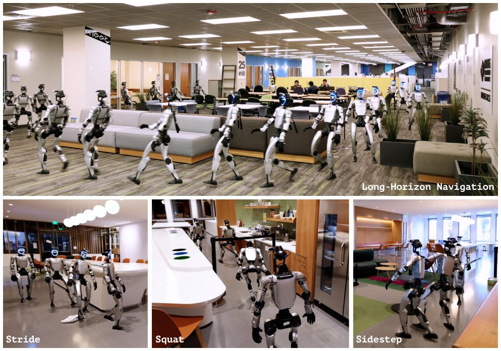

> *Generated by JarvisForResearchers Bot on 2026-09-10*

!!! tip "Why we featured this paper"
    Brand new preprint (2026) — accepted

## TL;DR
TANGO is a novel, whole-body vision-language-action (VLA) framework that enables language-conditioned humanoid traversal in cluttered indoor environments by directly predicting 29-DoF joint-space actions. It integrates perception, action generation, and motion tracking into a unified system, leveraging a scalable simulation pipeline (PET) for training.

## The Problem
Humanoid traversal in cluttered environments necessitates continuous, geometry-aware whole-body adaptation. This adaptation involves coordinating complex motions such as arm placement, torso adjustments, and gait modulation to ensure collision-free passage through intricate 3D spaces. Existing Vision-Language Navigation (VLN) methods are fundamentally inadequate for this task because they typically operate within low-dimensional action spaces, failing to explicitly model the intricate, high-dimensional kinematics required for physically feasible whole-body movement.

## Key Contributions
*   Introduction of TANGO, the first whole-body vision-language navigation framework designed for language-conditioned humanoid traversal within cluttered environments.
*   Development of a scalable simulation pipeline, Plan, Edit, Track (PET), engineered to automatically synthesize collision-free and dynamically feasible whole-body traversal trajectories.
*   Direct prediction of 29-DoF joint-space actions from language instructions and egocentric RGB observations, thereby eliminating the need for separate, brittle navigation and control modules.

## How It Works


*Figure 1 | Humanoid whole-body navigation in cluttered environments. We propose TANGO, a whole-body
foundation model for cluttered indoor scene navigation. TANGO demonstrates strong scene understanding
and robust traversal capability, navigating a 30-meter route zero-shot in a real-world cluttered o*

TANGO employs a triple-system architecture: System-2 (Vision-Language Perception), System-1 (Action Prediction), and System-0 (Motion Tracker). The process begins with System-2 processing visual and linguistic inputs to distill a contextual representation. This context is then fed into System-1, a flow-based model, which predicts a future reference action chunk. Finally, System-0 takes this predicted chunk and translates it into high-frequency joint commands for execution. The overall training objective minimizes a combined loss function: $L = L_{CE} + w_{FM} \cdot L_{FM}$, where the flow-matching weight $w_{FM}$ is set to 20.

### System-2: Vision-Language Perception
This component is instantiated using Qwen2.5VL-7B. It ingests stacked front ($I^f_t$) and downward ($I^d_t$) camera views, alongside the language instruction ($\ell$). Crucially, it employs Budget-Aware Token Sampling (BATS) to efficiently process these inputs and generate a compact latent context token, $z$.

### System-1: Multi-modal Diffusion Transformer (MM-DiT) Action Expert
This is a flow-based model responsible for action prediction. It conditions its output on the latent context token $z$ derived from System-2, along with the current robot proprioception ($q^{d,t}$). Using flow-matching, it predicts a future whole-body reference chunk, denoted as $\tilde{A}_{t:t+H}$.

### System-0: Off-the-shelf Motion Tracker (SONIC)
System-0 functions as the low-level execution layer. It receives the predicted action chunks ($\tilde{A}_{t:t+H}$) from System-1 and tracks this reference trajectory against the robot's actual proprioception. This tracking mechanism is responsible for generating the high-frequency joint commands required for real-time control.

### Plan, Edit, Track (PET) Pipeline
PET is an offline data generation pipeline. It integrates several components: A* path planning establishes the macro-level route; the SONIC motion planner converts this into executable trajectories; IsaacSim handles the rendering environment; SoftMimic-style pseudo-forces are used for trajectory editing to enhance diversity; and the SONIC tracker acts as a final executability filter to ensure synthesized data is physically plausible.

## Results
| Metric | Value | Baseline | Source |
| :--- | :--- | :--- | :--- |
| Success Rate (SR) | 70.31 | InternVLA-N1 [10] | Table 1 |
| Navigation Error (NE) | 3.90 | InternVLA-N1 [10] | Table 1 |
| Success weighted by Path Length (SPL) | 54.69 | RDP [27] | Table 1 |
| Oracle Success Rate (OSR) | 71.07 | RDP [27] | Table 1 |

## Why This Matters
The TANGO framework addresses a critical bottleneck in embodied AI: the gap between high-level semantic reasoning and low-level physical feasibility. By directly predicting 29-DoF joint-space actions, TANGO moves beyond abstract waypoint navigation. This allows the system to inherently reason about whole-body kinematics—such as maintaining balance while reaching around an obstacle—during the navigation planning phase. Furthermore, the PET pipeline demonstrates a viable path toward generating large-scale, high-fidelity training datasets necessary for training such complex, physically grounded models without exhaustive real-world data collection.

## Limitations & Open Questions
The current training methodology is heavily dependent on the PET pipeline, which necessitates substantial computational resources; specifically, generating the dataset required 211 GPU-hours across 64,633 trajectories. Additionally, the deployment architecture mandates a server-client separation to effectively decouple the low-frequency VLA inference loop from the high-frequency requirements of the WBC module. Future work should investigate methods to reduce the reliance on this intensive offline data synthesis or explore fully end-to-end training paradigms that can handle the inherent complexity of whole-body dynamics more directly.

---

## Citation

**Paper:** [2609.09158](https://arxiv.org/abs/2609.09158)

```bibtex
@article{260909158,
  title   = {TANGO: Humanoid Navigation in Cluttered Environments with a Whole-Body Vision-Language-Action Model},
  author  = {Anqi Li and Yuxin Chen and Zhaobo Li and Zhuo Cao and Junli Ren and Masayoshi Tomizuka et al.},
  journal = {arXiv preprint arXiv:2609.09158},
  year    = {2026},
  url     = {https://arxiv.org/abs/2609.09158}
}
```
