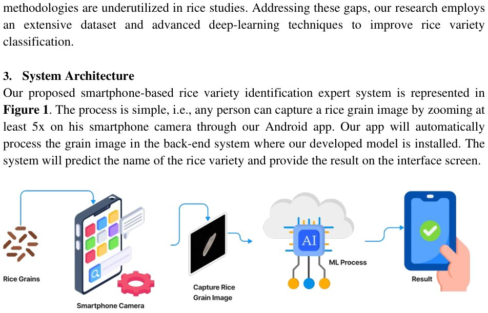

> *Generated by JarvisForResearchers Bot on 2026-09-11*

!!! tip "Why we featured this paper"
    arXiv preprint with 8 citations (≥ 5)

## TL;DR
This work introduces a stacked ensemble learning framework, leveraging deep features extracted from a self-curated dataset comprising 20 rice varieties, which achieves 100% classification accuracy for rice variety identification.

## The Problem
Current methodologies for precise rice variety classification, which rely on observable external characteristics such as color, size, and texture, suffer from a lack of robustness and efficiency. This deficiency creates vulnerabilities within the rice supply chain, facilitating fraudulent practices. Prior research has demonstrated limitations, including the reliance on time-consuming and often reagent-intensive traditional evaluation methods. Furthermore, existing deep learning applications in this domain are hampered by insufficient sample sizes and limited coverage of rice varieties, which fundamentally challenges the data-dependent nature of deep learning models.

## Key Contributions
We have made three primary contributions to this area. First, we developed a comprehensive and well-structured dataset encompassing 20 distinct rice varieties. Second, we successfully extracted diverse deep features from this image dataset by employing hyperparameter-optimized deep learning models. Third, we implemented a stacking-based ensemble approach, applied to the best-performing baseline models, specifically to enhance overall classification accuracy.

## How It Works


*Figure 1. System Architecture of our Proposed Model*

The proposed framework operates across five sequential stages: dataset construction, deep feature extraction via transfer learning, baseline model selection, stacking-based ensemble implementation, and final deployment via an Android application. In the feature extraction phase, ten distinct deep learning models (including VGG16, MobileNetV2, etc.) are fine-tuned to generate multiple, distinct feature sets. Subsequently, the stacking methodology integrates the predictions from the top 4 performing base models utilizing 14 specialized meta-learners. XGBoost is designated as the final meta-learner to synthesize these aggregated outputs and predict the specific rice variety, culminating in a system deployable on a smartphone.

### Feature Extracting
This initial stage involves the utilization of ten transfer learning models: VGG16, MobileNetV2, EfficientNetV2L, DenseNet201, NASNetLarge, ResNet50V2, Xception, InceptionV3, VGG19, and ResNet152V2. The objective is to extract rich, meaningful features from the input images, resulting in several distinct feature sets (e.g., Feature Set 01, Feature Set 02) that capture different aspects of the visual data learned by each pre-trained architecture.

### Ensemble: Stacking Method
The second stage integrates the feature sets derived from the base models using a stacking-based ensemble approach. This method is designed to leverage the complementary strengths of multiple models. Specifically, it employs 14 distinct meta-learners to process and integrate the predictions generated by the top 4 selected base models, aiming for a more generalized and robust final prediction.

### Meta-learners
The aggregation process relies on 14 diverse models functioning as meta-learners. These include Logistic regression, K-Nearest Neighbors, Support Vector Classifier, Decision Tree, Random Forest, AdaBoost Classifier, eXtreme Gradient Boosting Classifier, Gradient Boosting Classifier, Gaussian Nave Bayes, Passive Aggressive Classifier, Ridge Classifier, Stochastic Gradient Descent Classifier, Extra Trees Classifier, and Multi-Layer Perceptron C. Each meta-learner learns how to optimally combine the outputs from the base models.

### Final Classifier
The culmination of the ensemble process is the selection of XGBoost as the final classifier. This model receives the aggregated outputs from the stacking method and performs the final classification task, predicting the specific rice variety based on the synthesized evidence from the preceding layers.

## Results
| metric | value | baseline | source |
| :--- | :--- | :--- | :--- |
| classification accuracy | 100% | N/A | Abstract |

## Why This Matters
This research demonstrates that stacked ensemble learning can serve as a highly effective mechanism for significantly boosting classification accuracy in complex image recognition tasks, such as identifying rice varieties. Furthermore, the integration of the resulting ML models into a mobile application provides a pathway for accessible, on-the-spot quality assurance, which is critical for agricultural stakeholders. The success is underpinned by the use of self-curated, high-magnification datasets, exemplified by the 27,000 images collected for 20 varieties, which is crucial for training models with high fidelity.

## Limitations & Open Questions
A primary limitation of the current work is that the curated dataset, while extensive, does not fully account for the complexities encountered in real-world scenarios, such as the presence of mixed-grain samples or significant environmental variability in image capture. Future research efforts will necessarily focus on expanding the dataset to incorporate images captured from non-controlled environments and broadening the scope to include additional rice varieties sourced from diverse global regions.

---

## Citation

**Paper:** [2609.10524](https://arxiv.org/abs/2609.10524)

```bibtex
@article{260910524,
  title   = {Precision in Rice Variety Classification using Stacking-Based Ensemble Learning},
  author  = {Md. Masudul Islam and Galib Muhammad Shahriar Himel and Md. Golam Moazzam and Mohammad Shorif Uddin},
  journal = {arXiv preprint arXiv:2609.10524},
  year    = {2026},
  url     = {https://arxiv.org/abs/2609.10524}
}
```
