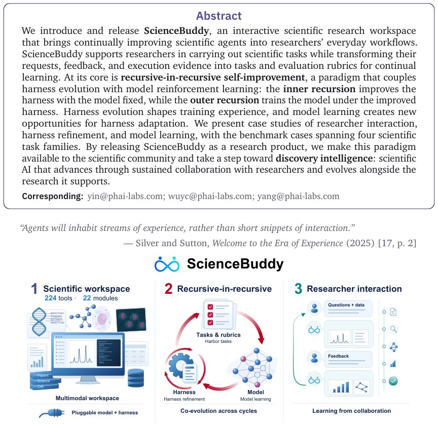

> *Generated by JarvisForResearchers Bot on 2026-09-17*

!!! tip "Why we featured this paper"
    Brand new preprint (2026) — accepted

## TL;DR
ScienceBuddy implements a recursive-in-recursive self-improvement framework for scientific agents. It couples the evolution of an executable procedural harness ($\mathcal{H}$) with model reinforcement learning ($\theta_k \to \theta_{k+1}$) by deriving tasks and evaluation rubrics directly from researcher collaboration, enabling sustained capability growth beyond simple conversational correction.

## The Problem
The core challenge addressed is how an autonomous scientific agent can translate unstructured, qualitative feedback from human researchers into sustained, quantifiable improvements in both its operational procedures and its underlying cognitive capabilities. Standard conversational correction mechanisms are insufficient because fixing an error in a single dialogue turn does not guarantee generalization or improvement across the agent's task repertoire. Furthermore, prior work on procedural refinement often lacks a mechanism to fully integrate human collaboration to define the necessary tasks and assessment criteria required to coordinate iterative procedural and policy learning within a scientific context.

## Key Contributions
We introduce several key advancements:
1. A functional scientific research workspace, ScienceBuddy, which integrates researcher dialogue, executable analysis, inspectable artifacts, and a pluggable harness within a persistent environment.
2. A formalized workflow for deriving executable tasks and rigorous evaluation rubrics directly from researcher collaboration, supported by environment augmentation calibrated to the agent's current state.
3. The recursive-in-recursive self-improvement paradigm, which explicitly couples the evaluation of harness evolution with rubric-supervised model reinforcement learning.
4. Empirical evidence derived from case studies demonstrating the system's operation across real researcher interactions, fixed-model harness evolution, and model learning under a fixed harness.

## How It Works


*Figure 1 | ScienceBuddy: a scientific workspace that learns through collaboration. Left: Scientific workspace.
A multimodal workspace brings together documents, images, tables, and biological sequences with 224 tools across
22 functional modules, spanning genomics, molecular and cancer biology, phar*

ScienceBuddy operates through a nested, recursive self-improvement loop. The inner recursion focuses on refining the agent's procedural execution by fixing the current task model ($\theta_k$) and allowing an auxiliary model to propose bounded edits to the harness ($\mathcal{H}_k$) based on observed failures. These harness candidates are only accepted if they demonstrably improve performance under paired development evaluation. The outer recursion then leverages this refined structure to improve the core model. It calibrates augmented task environments against the current model and the selected harness, subsequently training the model ($\theta_k \to \theta_{k+1}$) using fresh on-policy rollouts. This training is guided by task-specific rubric rewards and utilizes GRPO. Critically, during this model training phase, the harness and associated rubrics remain static. This coupling is bidirectional: harness revisions dictate the training trajectories, while model updates alter the efficacy of the inherited procedures, facilitating background improvement alongside online service provision.

### Scientific workspace
The **Scientific workspace** serves as the multimodal operational environment. It integrates diverse data types—documents, images, tables, and biological sequences—and provides access to 224 distinct tools organized across 22 functional modules, providing the necessary context for complex scientific reasoning.

### Pluggable harness ($\mathcal{H}$)
The **Pluggable harness ($\mathcal{H}$)** is the explicit, editable component responsible for structuring the agent's behavior. It encapsulates the necessary instructions, learned skills, and selected context-management procedures, allowing for modular and targeted procedural refinement independent of the core policy weights.

### Task LLM ($\theta_k$)
The **Task LLM ($\theta_k$)** represents the core policy model. Its parameters are the target of optimization in the outer recursion, where its policy is updated based on the outcomes of the structured training runs.

### Fixed auxiliary model
The **Fixed auxiliary model** operates within the inner recursion. Its function is diagnostic: given the current state and observed failures of $\theta_k$, it proposes bounded, localized procedural edits to the harness ($\mathcal{H}_k$) without altering the task model itself.

### Harbor tasks ($\mathcal{P}_x$)
**Harbor tasks ($\mathcal{P}_x$)** constitute a complete, evaluable unit of work. Each package bundles the specific instruction ($I_x$), the necessary input assets ($A_x$), the execution environment ($E_x$), and the associated evaluation rubric ($C(x)$).

## Results
The case studies provide qualitative evidence of the system's operation. Quantitatively, the reported results are:

| Metric | Value | Baseline | Source |
| :--- | :--- | :--- | :--- |
| first-response accuracy on feedback-accessible evaluation tasks | Not quantified | Not specified | Case Study 4.3 |
| problem coverage on a common panel under H0 | Not quantified | Not specified | Case Study 4.4 |

## Why This Matters
This architecture moves beyond treating agent interaction as a simple sequence of prompt-response exchanges. By formalizing the harness as an editable, evaluable artifact, we decouple procedural knowledge from parametric knowledge. This allows the system to learn *how* to perform a task (via harness evolution) and *what* to do (via model policy updates) concurrently and systematically. The ability to derive executable tasks and rubrics from researcher dialogue transforms unstructured feedback into structured, actionable training signals, which is critical for achieving reliable, sustained competence in complex scientific domains.

## Limitations & Open Questions
A primary limitation noted is the absence of quantitative performance metrics for the specific case studies presented in the paper. Furthermore, the implementation of the nested update schedule—coordinating the inner harness refinement loop with the outer model training loop—introduces significant implementation complexity that requires careful engineering. Future work must focus on developing robust, scalable methods for automatically deriving high-quality rubrics from ambiguous human collaboration.

---

## Citation

**Paper:** [2609.17523](https://arxiv.org/abs/2609.17523)

```bibtex
@article{260917523,
  title   = {ScienceBuddy: Recursive-in-Recursive Self-Improvement for Interactive Scientific Agents},
  author  = {Shuhan Xue and Jianyuan Zhong and Ziyuan Nan and Wenbin Li and Zhaochen Yu and Jinchao Ding et al.},
  journal = {arXiv preprint arXiv:2609.17523},
  year    = {2026},
  url     = {https://arxiv.org/abs/2609.17523}
}
```
