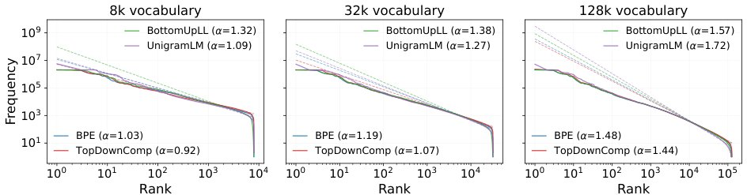

> *Generated by JarvisForResearchers Bot on 2026-09-18*

!!! tip "Why we featured this paper"
    Brand new preprint (2026) — accepted

## TL;DR
This work introduces two novel tokenization algorithms, BottomUpLL and TopDownComp, to systematically disentangle the influence of tokenization optimization objectives (compression vs. log-likelihood) and search procedures (bottom-up vs. top-down). By constructing a $2\times2$ design space, we demonstrate that the search procedure often dominates metrics like bits-per-byte (BPB), while the optimization objective's impact is context-dependent, particularly at small vocabulary sizes.

## The Problem
A fundamental ambiguity persists in the field regarding the criteria for an optimal tokenizer. Current comparative analyses between established algorithms, such as Byte-Pair Encoding (BPE) and Unigram Language Model (UnigramLM), conflate two distinct sources of algorithmic variation: the underlying optimization objective (i.e., minimizing compression or maximizing log-likelihood) and the employed search procedure (i.e., bottom-up merging or top-down pruning). Existing comparisons fail to isolate these effects. Furthermore, the direct optimization of the desired tokenization objective function is often computationally intractable.

## Key Contributions
We make three primary contributions:
1. Introduction of BottomUpLL, a novel bottom-up tokeniser that optimizes for corpus log-likelihood.
2. Introduction of TopDownComp, a novel top-down tokeniser that optimizes for compression.
3. A systematic disentanglement of how the search procedure interacts with the optimization objective to influence language modeling performance.

## How It Works


*Figure 2: Frequency–rank token distributions induced by each tokeniser on the held-out test set. Solid lines are
empirical curves; dashed lines are the fitted power laws, whose negated slopes are the Zipf α values in Tab. 1.*

The study formalizes a $2\times2$ design space by crossing two objectives—compression ($G_{comp}$) and log-likelihood ($G_{ll}$)—with two search procedures—bottom-up construction and top-down pruning.

### BPE
BPE employs a bottom-up search procedure. Its objective is inherently geared toward maximizing compression by iteratively merging the most frequent adjacent byte pairs.

### UnigramLM
UnigramLM utilizes a top-down search procedure. It operates by iteratively pruning tokens from a superset vocabulary, optimizing the resulting vocabulary to maximize the overall corpus log-likelihood.

### BottomUpLL
BottomUpLL is designed to mirror the bottom-up merge procedure characteristic of BPE. However, instead of optimizing for compression, it optimizes the corpus log-likelihood ($G_{ll}$). The incremental score used for merging is derived from the likelihood objective.

### TopDownComp
TopDownComp mirrors the top-down pruning procedure of UnigramLM. Crucially, it optimizes for compression ($G_{comp}$) rather than log-likelihood. This requires approximating the compression gain associated with deleting a token from the vocabulary.

The search procedures rely on incremental scoring. For bottom-up construction, the merge gain is defined as $\Delta G(\cdot, D)_{s1,s2}$. For TopDownComp, the deletion cost is $\Delta G(\cdot, D)_s$. Specifically, for BottomUpLL, the compression gain is exact: $\Delta G_{comp}(\cdot, D)_{s1,s2} = n_D^{s1,s2}$ (Lemma 1). For TopDownComp, approximations are necessary, such as $\Delta G_{ll}(\cdot, D)_s \approx n_D^s (\log p_\theta(s) - \log p_\theta(s_{rep}^s))$ (Lemma 3).

## Results
| Metric | Value | Baseline | Source |
| :--- | :--- | :--- | :--- |
| bits-per-byte (BPB) | bottom-up tokenisers consistently achieve lower bits-per-byte in most settings | N/A | Abstract |
| BLiMP task performance | no consistent relationship between design choice and performance | N/A | Abstract |
| Performance at small vocabulary settings | likelihood-based tokenisers outperform compression-based ones | N/A | Abstract |

## Why This Matters
The findings suggest that the search procedure (bottom-up versus top-down) is the dominant factor influencing metrics related to data efficiency, such as bits-per-byte (BPB). Conversely, the influence of the optimization objective is context-dependent; its importance is amplified when operating under constraints, such as small vocabulary settings. This necessitates that practitioners view tokenizer design not as a monolithic choice, but as a coupled decision involving both the chosen objective function and the search methodology.

## Limitations & Open Questions
A primary limitation stems from the inherent asymmetry in the search procedures. The deletion costs utilized in top-down methods, $\Delta G(\cdot, D)_s$, are approximations due to the nature of the encoding function $tok_{\Rightarrow}[S]$. This contrasts with the exact merge gains available in bottom-up procedures. This asymmetry is an intrinsic property of the top-down search paradigm itself.

---

## Citation

**Paper:** [2609.19145](https://arxiv.org/abs/2609.19145)

```bibtex
@article{260919145,
  title   = {Objective vs. Search: Decomposing What Makes a Good Tokeniser},
  author  = {Ahmetcan Yavuz and Clara Meister and Tiago Pimentel},
  journal = {arXiv preprint arXiv:2609.19145},
  year    = {2026},
  url     = {https://arxiv.org/abs/2609.19145}
}
```
