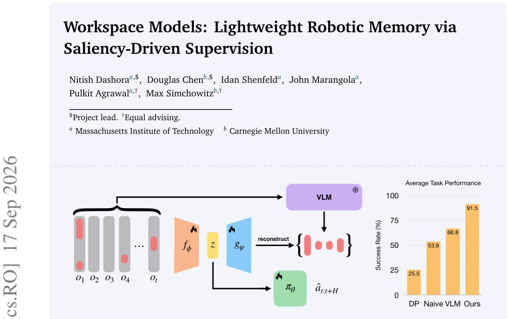

> *Generated by JarvisForResearchers Bot on 2026-09-19*

!!! tip "Why we featured this paper"
    Brand new preprint (2026) — accepted

## TL;DR
The Workspace Model introduces a mechanism to distill long-term, salient historical information from complex robotic observations into a compact, lightweight latent representation—the workspace token. By leveraging powerful Vision-Language Models (VLMs) exclusively during the training phase to generate saliency supervision, this approach enables robotic policies to solve memory-intensive tasks with significantly reduced inference latency compared to methods that query VLMs at deployment time.

## The Problem
Complex robotic manipulation tasks inherently require the agent to maintain and reason over long-term contextual memory. A straightforward approach of conditioning policies on the full sequence of past observations, however, is problematic. This high-dimensional input history often leads to the policy learning spurious correlations rather than robust causal features, resulting in performance degradation. Alternatively, existing methods attempt to summarize this history using powerful VLMs during the inference loop. While this addresses the input dimensionality, it introduces a critical bottleneck: the high computational cost and associated latency incurred by running large models at deployment time, which is unacceptable for real-time robotic control.

## Key Contributions
This work makes three primary contributions:
1. Introduction of workspace models: a lightweight memory encoder for robotic policies achieving high performance without deployment-time VLM computation.
2. Exploiting saliency-driven supervision by using inference compute on strong models during training to provide saliency labels.
3. Demonstrating that workspace tokens are not only more lightweight but also lead to better policy performance compared to test-time key-frame selection.

## How It Works


*Figure 1: We propose the Workspace Model, an architecture trained to produce compressed latent repre-
sentations of history used for downstream policy learning. Workspace Models are trained by encoding raw
histories and reconstructing high-level salient information, as judged by a VLM, thus amortizi*

The core idea of the Workspace Model is to amortize the computational burden of VLM reasoning from the deployment phase to the training phase. We train an autoregressive encoder, $f_\phi$, to compress the sequence of raw observations $o_{1:t}$ into a fixed-size latent summary, the workspace token, $w_t = f_\phi(o_{1:t})$.

During training, we utilize the reasoning power of a VLM to curate a salient set $S_t$ of image patches deemed most relevant from the history $o_{1:t}$. The encoder $f_\phi$ is then co-trained with a decoder $g_\psi(w_t)$. This decoder is structured following the DETR framework and is tasked with reconstructing the salient set $S_t$ from the generated workspace token $w_t$, utilizing a Hungarian matching set reconstruction loss. This forces the encoder to learn a representation that is maximally informative regarding the salient visual content.

Once training is complete, the encoder $f_\phi$ is frozen. The final reactive policy, $\pi_\theta$, is then trained to predict action sequences conditioned only on a short, fixed history of these frozen workspace embeddings ($w_{t-C:t}$) and the current proprioceptive states ($x_{t-C:t}$): $\pi_\theta(a_{t:t+H} | w_{t-C:t}, x_{t-C:t})$. This design ensures that the computationally expensive VLM queries are confined to the offline training pipeline, allowing for low-latency execution at runtime.

### Workspace Token ($w_t$)
The workspace token, $w_t$, is the output of the workspace encoder $f_\phi$. It functions as a dense, compressed vector representation encapsulating the most salient historical information observed up to time $t$. Its design goal is to be a highly informative, yet computationally inexpensive, substitute for the raw, high-dimensional observation history.

### Workspace Encoder ($f_\phi$)
The workspace encoder, $f_\phi$, is implemented as a transformer architecture incorporating causal masking. It accepts a sequence of input tokens, which are a concatenation of processed observation tokens and associated saliency indicators, $[(\bar{o}_{t'}, z_{t'})]_{t' \le t}$. Its function is to iteratively process this sequence and output the corresponding sequence of workspace tokens, $w_{1:t}$.

### Workspace Decoder ($g_\psi$)
The workspace decoder, $g_\psi$, is parameterized using a structure analogous to DETR. Its role is to perform set reconstruction. Given the workspace token $w_t$, it outputs a set of $m$ predicted pairs, $\left\{(\hat{p}_{t;j}, \beta_{t;j})\right\}_{j=1}^m$, where $\hat{p}_{t;j}$ represents a predicted patch location and $\beta_{t;j}$ represents its associated relevance score, allowing for a direct comparison against the ground-truth salient set $S_t$.

### Salient Set ($S_t$)
The salient set, $S_t$, serves as the supervision signal derived from the VLM during training. It is an indexed set composed of DinoV3 patch tokens extracted from the images observed up to time $t$. This set is strictly capped at a maximum size $m$ to maintain tractability during the reconstruction loss calculation.

### Policy ($\pi_\theta$)
The final policy, $\pi_\theta$, is implemented as a Diffusion Policy. Crucially, it is trained to condition its action prediction on a short, fixed history window of the pre-computed workspace tokens ($w_{t-C:t}$) alongside the current proprioceptive states ($x_{t-C:t}$). This architecture ensures that the policy operates on a low-dimensional, context-rich state representation, enabling fast inference.

## Results
The performance of the Workspace Model is evaluated against established baselines across various memory-intensive tasks.

| Metric | Value | Baseline | Source |
| :--- | :--- | :--- | :--- |
| Success Rate (%) | 91.5 | DP Naive VLM | Table 1 |
| Success Rate (%) | 66.8 | DP Naive VLM | Table 1 |
| Success Rate (%) | 53.8 | DP Naive VLM | Table 1 |
| Success Rate (%) | 25.5 | DP Naive VLM | Table 1 |
| Latency (ms) | 94.9 | Keyframe | Table 1 |

## Why This Matters
The Workspace Model provides a principled pathway to integrate long-term memory into robotic control systems without incurring the prohibitive computational overhead of real-time large model inference. By shifting the heavy lifting of history summarization to the training phase via saliency-driven supervision, we achieve a system that is both high-performing and deployable in latency-sensitive robotic applications. The demonstrated improvement over naive history concatenation and key-frame selection validates the efficacy of learning a compact, task-relevant latent memory.

## Limitations & Open Questions
The current implementation of the workspace model relies on using keyframe patches as the input for saliency-driven supervision, which the authors note is a preliminary instantiation of the concept. A significant avenue for future research involves investigating the utility of other modalities for generating supervision signals, such as incorporating textual descriptions or full video sequences into the saliency curation process.

---

## Citation

**Paper:** [2609.20820](https://arxiv.org/abs/2609.20820)

```bibtex
@article{260920820,
  title   = {Workspace Models: Lightweight Robotic Memory via Saliency-Driven Supervision},
  author  = {Nitish Dashora and Douglas Chen and Idan Shenfeld and John Marangola and Pulkit Agrawal and Max Simchowitz},
  journal = {arXiv preprint arXiv:2609.20820},
  year    = {2026},
  url     = {https://arxiv.org/abs/2609.20820}
}
```
