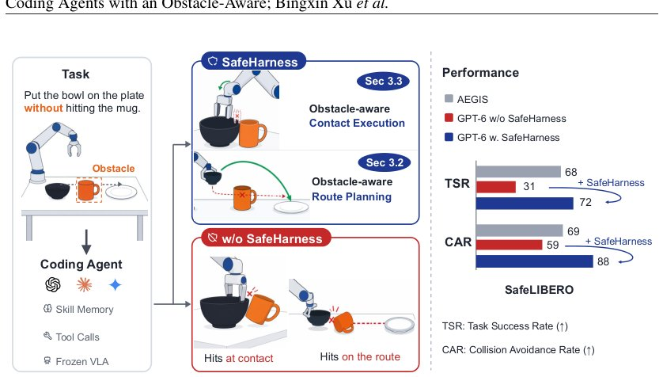

> *Generated by JarvisForResearchers Bot on 2026-09-20*

!!! tip "Why we featured this paper"
    Brand new preprint (2026) — accepted

## TL;DR
SAFEHARNESS introduces two obstacle-aware harnesses—one for route planning and one for contact execution—to enforce safety constraints as a first-class objective during robot manipulation tasks driven by coding agents. This approach moves beyond post-hoc filtering by embedding safety directly into the motion generation process, achieving significant gains in both task success and collision avoidance on SafeLIBERO.

## The Problem
Coding agents show promise for autonomous robot manipulation, yet they fundamentally fail to prioritize safety constraints. Even when safety requirements are explicitly stated in the prompt, the agent's planning mechanism treats them as secondary instructions rather than hard constraints. This results in predictable collisions with obstacles during execution. The core issue is that the safety requirement is never elevated to a core priority during the planning phase.

Prior work exhibits several limitations:
1. Rollouts are evaluated solely on goal achievement, neglecting the trajectory's interaction with the environment.
2. Simply augmenting the prompt with safety instructions does not alter the agent's behavior; the failure resides in the planning logic, not perception or instruction fidelity.
3. Existing safety mechanisms—such as pre-computed planners, post-hoc filters, or trained safety policies—either fix the trajectory before execution or apply safety checks after the policy has already committed to a motion, failing to integrate safety into the decision that generates the motion itself.

## Key Contributions
We present the following contributions:
1. We study the paradigm of coding agents under a safety constraint that has previously lacked a rigorous, quantifiable evaluation metric.
2. We introduce SAFEHARNESS, a framework utilizing two distinct obstacle-aware harnesses designed to treat safety as an objective on equal footing with task completion.
3. We demonstrate that SAFEHARNESS achieves 71.9% task success and 87.5% collision avoidance on SafeLIBERO, representing improvements of 6.5% and 27.0%, respectively, over the previous state-of-the-art.

## How It Works


*Figure 1: SAFEHARNESS puts safety on par with task completion. Coding agent receives a task
instruction with a safety constraint, along with observation images. SAFEHARNESS then equips
it with obstacle-aware route planning (Sec. 3.2) and obstacle-aware contact execution (Sec. 3.3) to
enforce safety *

SAFEHARNESS addresses the safety challenge by decomposing the manipulation task into two distinct phases: a route planning phase (free-space movement) and a contact-rich execution phase. Safety is enforced specifically within both phases using specialized, obstacle-aware mechanisms.

### Obstacle-aware Route Planning
This component operates by grounding both the target objects and the obstacles as geometric bounding boxes. The agent generates candidate routes as sequences of waypoints (a polyline). The core mechanism involves verifying this planned route against the obstacle bounding boxes. If the verification fails—meaning the planned path intersects an obstacle box—the agent is forced to replan. Furthermore, if execution halts due to an unpredicted physical constraint, the system triggers a replan cycle. This iterative plan-verify-execute loop ensures that the generated path adheres to known obstacle boundaries.

### Obstacle-aware Contact Execution
This component governs the fine-grained decision-making during physical interaction. It determines the precise contact position and the required gripper rotation. The decision logic is contingent upon an adjacency test between the obstacle and the designated contact target. If an obstacle is found to be adjacent to the contact target, the system constrains the contact approach. Specifically, it prioritizes the approach direction that maximizes clearance from the adjacent obstacle, thereby embedding the safety constraint directly into the contact strategy selection.

## Results
The empirical evaluation on the SafeLIBERO benchmark demonstrates the efficacy of the SAFEHARNESS framework.

| Metric | Value | Baseline | Source |
| :--- | :--- | :--- | :--- |
| Task Success Rate (SafeLIBERO) | 71.9% | Previous SOTA | Table 3.3 |
| Collision Avoidance Rate (SafeLIBERO) | 87.5% | Previous SOTA | Table 3.3 |
| Task Success Rate Improvement (vs. w/o Harnesses) | 2.3$\times$ | Same agent without harnesses | Table 3.3 |
| Collision Avoidance Rate Improvement (vs. w/o Harnesses) | 1.5$\times$ | Same agent without harnesses | Table 3.3 |

## Why This Matters
The findings confirm a critical paradigm shift required for deploying LLM-driven agents in physical robotics. Safety cannot be treated as a post-hoc filter or a mere suggestion in the prompt; it must be architecturally integrated into the decision-making process itself. By decomposing the task and applying specialized, constraint-aware mechanisms to each phase (routing vs. contact), we demonstrate a scalable method for enforcing complex physical constraints. Furthermore, the success of the iterative planning cycle highlights that for long-horizon tasks, the ability to dynamically verify and correct plans against unforeseen environmental states is non-negotiable.

## Limitations & Open Questions
The current implementation of the route planning verifier is limited to checking for intersection with the obstacle bounding boxes based on an approximately measured scene representation. This scope excludes other critical physical constraints that might arise during motion. Additionally, in long-horizon episodes, the accumulation of extensive records—comprising tool calls and visual observations—within the agent's context window presents a risk of information overload, which could potentially degrade the reliability of the initial, critical safety constraint sentence. Future work must address robust context management to maintain constraint fidelity over extended operational periods.

---

## Citation

**Paper:** [2609.20822](https://arxiv.org/abs/2609.20822)

```bibtex
@article{260920822,
  title   = {Coding Agents with an Obstacle-Aware Harness for Safe Robot Manipulation},
  author  = {Bingxin Xu and Yuzhang Shang and Zhen Dong and Emilio Ferrara},
  journal = {arXiv preprint arXiv:2609.20822},
  year    = {2026},
  url     = {https://arxiv.org/abs/2609.20822}
}
```
