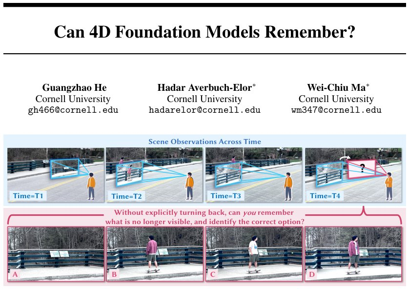

> *Generated by JarvisForResearchers Bot on 2026-09-21*

!!! tip "Why we featured this paper"
    Brand new preprint (2026) — accepted

## TL;DR
We introduce PERSISTBENCH, a novel dataset and metric suite built upon 360$^\circ$ videos to rigorously assess whether 4D foundation models exhibit object-centric visual memory. By testing object permanence, motion continuity, and appearance preservation, we demonstrate that current models suffer significant performance degradation when objects leave the input field of view, indicating a failure in retaining object-specific state beyond immediate sensory input.

## The Problem
Current 4D foundation models are capable of perceiving and reconstructing dynamic environments. However, a critical gap remains regarding their capacity for visual memory: specifically, how effectively they retain information about perceived objects when those objects transition out of the observable field of view. Existing evaluation methodologies are insufficient for this task. Specifically, prior benchmarks predominantly rely on pixel-level metrics and lack the necessary ground truth for objects once they exit the view, precluding an object-centric assessment of visual memory. Furthermore, reconstruction benchmarks are inherently limited to evaluating rendering fidelity, failing to capture the object-centric nature of memory. Generative model benchmarks, being largely reference-free, cannot verify if a model faithfully preserves the appearance, location, and motion state of specific entities it has previously observed.

## Key Contributions
This work makes three primary contributions:
1. Introduction of PERSISTBENCH, the first benchmark providing real-world, ground truth observations designed to systematically evaluate visual memory within 4D foundation models.
2. Proposal of three distinct, object-centric evaluation aspects: object permanence, motion continuity, and appearance preservation.
3. Leveraging 360$^\circ$ videos as an omniscient ground truth source to construct input-reference pairs where target objects are intentionally removed from the input field of view.

## How It Works


*Figure 1: As humans, we effortlessly maintain a dynamic mental representation of the world: after
briefly observing a scene (top), we can infer what lies beyond our current field of view and antic-
ipate how objects continue to move and appear over time. Test which option best matches your
expectati*

The evaluation methodology involves probing a 4D foundation model, $f$, using a set of target probes $\\{\bm{p}_t\\}_{t=1}^T$. These probes generate outputs $\\{\mathcal{O}_t\\}_{t=1}^T$ from a set of initial input observations $\\{\mathcal{I}_i\\}_{i=1}^N$. The generated outputs are then compared against ground-truth references $\\{\mathcal{O}^{\text{ref}}_t\\}_{t=1}^T$ using a set of criteria $g$. Crucially, three metrics are employed to decouple the assessment of memory from mere rendering fidelity.

### 4D Foundation Model ($f$)
This is the model under investigation. It accepts the input observations $\\{\mathcal{I}_i\\}$ and the target probes $\\{\bm{p}_t\\}$ to produce the corresponding generated outputs $\\{\mathcal{O}_t\\}$.

### Target Probes ($\\{\bm{p}_t\\}$)
These are defined as camera trajectories parameterized in $\text{SE}(3)$. They are used to query the foundation model, effectively forcing the model to generate scenes corresponding to viewpoints that may not have been present in the initial input observations.

### SAM2 [60]
This component is integral to the Object Permanence evaluation. It is utilized to track the target object across the generated frames, producing a valid segmentation mask, denoted $\text{SAM}_t$.

### VLM [93, 20, 83]
The Vision-Language Model (VLM) is employed alongside the tracker's output in the Object Permanence evaluation. Its role is to provide semantic confirmation of the target object's presence, complementing the geometric tracking provided by SAM2.

### DINOv2 [51]
For the Appearance Preservation metric, DINOv2 is used to extract high-dimensional feature maps, specifically $\mathbf{F}_t^{\text{pred}}$ from the generated frame and $\mathbf{F}_t^{\text{ref}}$ from the ground-truth reference frame. These features are then compared via cosine similarity.

## Results
The evaluation across the PERSISTBENCH suite yielded consistent findings regarding the limitations of current models.

| Metric | Value | Baseline | Source |
| :--- | :--- | :--- | :--- |
| Performance Degradation | Every model performs substantially worse once the target object becomes invisible by leaving the input field of view. | N/A | Section 1 |

## Why This Matters
The results underscore a critical insight: high reconstruction fidelity does not equate to robust visual memory. The necessity of object-centric evaluation is paramount; relying solely on pixel-level metrics masks fundamental failures in state retention. Furthermore, the utilization of 360$^\circ$ videos provides a necessary paradigm shift, offering a rigorous, reference-based testing environment for out-of-view dynamics. Finally, the decomposition into permanence, continuity, and appearance confirms that visual memory is not a monolithic capability but a composite function requiring granular assessment.

## Limitations & Open Questions
The current evaluation setup operates under the assumption that both the input observations $\\{\mathcal{I}_i\\}$ and the generated outputs $\\{\mathcal{O}_t\\}$ are provided in video format, although the underlying formulation is generalizable to other modalities. A specific constraint in the Motion Continuity metric is that its calculation is restricted only to those frames where the object is successfully tracked, i.e., where $\text{SAM}_t = 1$. Future work should address the robustness of the tracking mechanism itself when memory is degraded.

---

## Citation

**Paper:** [2609.20819](https://arxiv.org/abs/2609.20819)

```bibtex
@article{260920819,
  title   = {Can 4D Foundation Models Remember?},
  author  = {Guangzhao He and Hadar Averbuch-Elor and Wei-Chiu Ma},
  journal = {arXiv preprint arXiv:2609.20819},
  year    = {2026},
  url     = {https://arxiv.org/abs/2609.20819}
}
```
