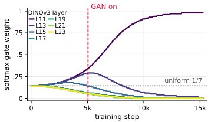

> *Generated by JarvisForResearchers Bot on 2026-09-29*

!!! tip "Why we featured this paper"
    Brand new preprint (2026) — accepted

## TL;DR
FuseReg addresses the reconstruction-generation gap in Representation Autoencoders (RAEs) by introducing layer-fusion regularization. This technique trains both the decoder and the generator on normalized fusions derived from randomly sampled subsets of encoder layers, ensuring robustness across varying latent representations.

## The Problem
Representation Autoencoders (RAEs) are fundamentally constrained by a trade-off inherent in their architecture. Shallower encoder layers tend to retain finer pixel-level details, which is beneficial for the reconstruction objective. Conversely, deeper encoder layers typically yield superior metrics when evaluated against generative objectives, such as those used in diffusion models. This discrepancy results in a mismatch in latent preference: the latent space optimized for reconstruction does not align optimally with the latent space required for high-fidelity generation. Existing approaches fail to resolve this by optimizing around a single, fixed representation configuration. Prior work, such as RAEv2, relies on a fixed summation of the final several encoder layers, while deterministic fusion methods (e.g., DRoRAE or attentive multi-layer probing) converge on a single, preferred layer composition, none of which dynamically address the reconstruction-generation divergence.

## Key Contributions
We introduce FuseReg, a layer-fusion regularizer designed to mitigate the reconstruction–generation gap. This is achieved by training the decoder and generator on normalized fusions derived from randomly sampled encoder layers. Furthermore, we provide a theoretical foundation for this randomized fusion, demonstrating that FuseReg preserves the full-layer mean while transforming cross-layer disagreement into an explicit regularization penalty. Finally, we demonstrate that a single FuseReg decoder can achieve robust reconstruction quality when tested against full, sparse, and single-layer fusions.

## How It Works


*Figure 1: A learnable gate collapses onto a shal-
low layer. Per-layer gate weights over training for
a softmax gate on DINOv3 layers. The shallowest
layer grows to dominate while deeper layers decay
to 0; the collapse accelerates once the GAN is on.*

FuseReg fundamentally shifts the paradigm from fixed heuristic layer selection to training over stochastic subsets of encoder layers. During the training process, a Bernoulli mask, $e^m$, is drawn and conditioned to be non-zero. This mask defines a subset $S$ of the $K$ chosen encoder layers, allowing the construction of a subset mean latent vector: $z^m = \frac{1}{|S|} \sum_{k \in S} h_k$. This process is applied independently to the decoder, using a sampling rate $p_{dec}$, and to the Diffusion Transformer (DiT), using a rate $p_{dit}$.

The decoder is tasked with reconstructing the input $\hat{x} = D(z^m)$ under a composite loss function incorporating pixel, perceptual, and adversarial objectives. Concurrently, the DiT is trained to regress the full-layer target $\bar{h}$ from a noisy subset aggregate $z^t_m$, minimizing $L_{DiT}$. This dual regularization mechanism forces both the reconstruction stage and the generative stage to maintain robustness across a spectrum of varying layer compositions.

### Frozen Visual Encoder (E)
The Frozen Visual Encoder (E) is responsible for generating a hierarchy of features. For a given input image $x$, it produces feature representations $h_k = LN(E_{l_k}(x))$ for $K$ pre-selected layers $l_k$ within the encoder backbone. These features serve as the raw material for the fusion process.

### Layer-Fusion Rule
The Layer-Fusion Rule describes the mechanism by which features from the $K$ chosen layers are combined into a single latent vector. This is achieved via a weighted sum: $z_a = \sum_{k=1}^K a_k h_k$, where the weights $a$ are normalized such that $\sum a_k = 1$. While this rule defines the general fusion capability, FuseReg leverages a randomized instantiation of this concept.

### Random Subset Sampling (FuseReg)
This component implements the core of FuseReg. It draws a Bernoulli mask $e^m$ and enforces the condition that the mask is non-zero. This selection process yields a subset $S$ of the available layers, allowing the construction of the subset mean latent $z^m = \frac{1}{|S|} \sum_{k \in S} h_k$. This stochastic sampling is the mechanism by which the system is regularized against fixed layer dependencies.

### ViT Decoder (D)
The ViT Decoder (D) operates on the subset-fused latent $z^m$ to produce a reconstruction $\hat{x} = D(z^m)$. Its training is governed by the loss function $L_{dec} = \lVert \hat{x} - x \rVert^2 + \lambda_p L_{LPIPS}(\hat{x}, x) + \lambda_g L_{GAN}(\hat{x})$, which enforces fidelity across pixel, perceptual, and adversarial domains.

### Diffusion Transformer (DiT)
The Diffusion Transformer (DiT) serves as the generative component. It is trained to regress the full-layer target $\bar{h}$ from a noisy subset aggregate $z^t_m$. The objective function is $L_{DiT} = E(x,c,m,t,\epsilon)\left[\rho(t)\left\|\mathcal{X}_\theta(z^t_m, t, c) - z_{full}\right\|^2\right]$. This forces the generator to be predictive even when conditioned on incomplete or randomly sampled latent information.

## Results
The empirical evaluation demonstrates the efficacy of the FuseReg framework across various metrics:

| Metric | Value | Baseline | Source |
| :--- | :--- | :--- | :--- |
| PSNR | 27.52 | 27.04 | Table 1 |
| rFID | 0.42 | 0.18 | Table 1 |
| unguided gFID (Decoder replacement alone) | 2.21 | 3.01 | Section 5.2 |
| DiT-Base gFID (Joint regularization) | 9.93 | 13.96 | Section 5.3 |

## Why This Matters
The practitioner takeaways highlight the practical utility of this approach. Layer-fusion regularization enables a single decoder to maintain high performance across diverse latent compositions—including full, sparse, and single-layer fusions—without requiring retraining for each configuration. Furthermore, the joint regularization of both the decoder and the generator yields complementary gains in generation quality that surpass the improvements achievable through single-stage regularization. Fundamentally, this method provides a principled, controlled mechanism to perturb layer disagreement in the latent space without inducing a shift in the expected latent representation, a control mechanism governed by the drop rate $p$.

## Limitations & Open Questions
We acknowledge certain limitations in the current formulation. Specifically, the theoretical analysis concerning the regularization effect relies on a linear squared-loss model, which serves as an analytically tractable surrogate for the full non-linear system. Additionally, the paper notes that the curves presented in Figure 3 do not exhibit uniform monotonicity when the decoder is swapped between different configurations. Future work should address the generalization of the theoretical guarantees beyond the linear approximation and investigate the implications of non-monotonic behavior in the latent space.

---

## Citation

**Paper:** [2609.31620](https://arxiv.org/abs/2609.31620)

```bibtex
@article{260931620,
  title   = {FuseReg: Regularizing Layer Fusion Mitigates the Reconstruction-Generation Gap in Representation Autoencoders},
  author  = {Hongyang Du and Yunfei Xie and Junjie Ye and Jiawei Yang and Xiaoyan Cong and Haodong Zhang et al.},
  journal = {arXiv preprint arXiv:2609.31620},
  year    = {2026},
  url     = {https://arxiv.org/abs/2609.31620}
}
```
